## 1. vue-admin-template

**`本节任务:`**  熟悉人资项目依赖的社区后台管理系统 vue-admin-template 

### 方案介绍

https://panjiachen.gitee.io/vue-admin-template/#/login

> 我们先要做的后台管理系统比较庞大，如果从零开始需要耗费很多时间来搭建架子，所以我们需要一个可以直接搭好了常用的功能，我们只需要在上面做二次开发的现成项目，而`vue-admin-tempalte`就是为了解决这个问题的
>

### 运行体验

```bash
$ git clone https://gitee.com/cp_fe/vue-admin.git  #拉取代码
$ cd vue-admin #切换到具体目录下
$ yarn  #安装所有依赖
$ yarn dev  #启动开发调试模式  查看package.json文件的scripts可知晓启动命令
```

## 2. 项目目录熟悉

**`本节任务:`** 对vue-admin做一个目录熟悉

**目录结构**

本项目已经为你生成了一个基本的开发框架，提供了涵盖中后台开发的各类功能和现成目录，下面是整个项目的目录结构

```bash
├── build                      # 构建相关              
├── public                     # 静态资源
│   │── favicon.ico            # favicon图标
│   └── index.html             # html模板
├── src                        # 源代码
│   ├── api                    # 所有请求
│   ├── assets                 # 主题 字体等静态资源  不会参与打包  直接直出
│   ├── components             # 全局公用组件 和业务不相关  上传组件
│   ├── icons                  # 项目所有 svg icons
│   ├── layout                 # 全局 layout 负责搭建项目的整体架子结构 html结构
│   ├── router                 # 路由
│   ├── store                  # 全局 store管理 vuex管理数据的位置 模块化开发 全局getters
│   ├── styles                 # 全局样式
│   ├── utils                  # 全局公用方法 request.js
│   ├── vendor                 # 公用vendor
│   ├── views                  # views 所有页面 路由级别的组件
│   ├── App.vue                # 入口页面 根组件
│   ├── main.js                # 入口文件 加载组件 初始化等
│   └── permission.js          # 权限管理
│   └── settings.js          # 配置文件
├── .env.xxx                   # 环境变量配置
├── .eslintrc.js               # eslint 配置项
├── .babelrc                   # babel-loader 配置
├── vue.config.js              # vue-cli 配置
├── postcss.config.js          # postcss 配置
└── package.json               # package.json
```

虽然目录很多，我们现阶段需要关注的就是 src 目录，里面有我们所有的业务文件

## 3. 使用gitee管理项目

**`本节任务:`** 使用gitee管理我们的人资项目

1）在gitee中新建一个仓库

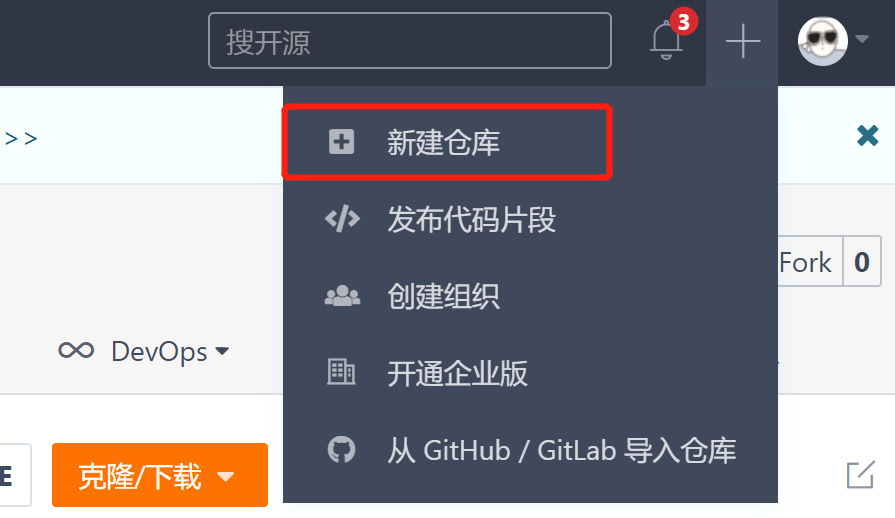

2）填写必要的仓库信息

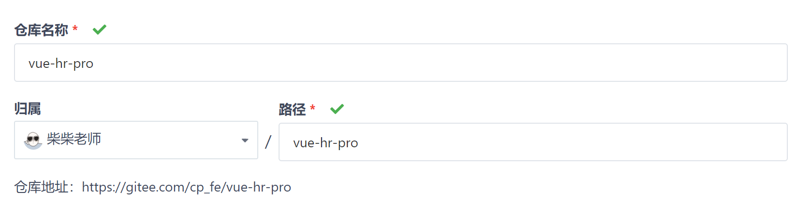

3）删除`本地vue-admin`项目中的.git文件夹

> 因为我们的项目是从别人的仓库克隆下来的,本地仓库和他的远程仓库有一个关联,必须先断掉,所以需要删除.git文件夹

4） 重新初始化本地仓库 

```bash
git init 
# 执行完毕应该可以看到一个新的.git文件夹
```

5）关联远程仓库

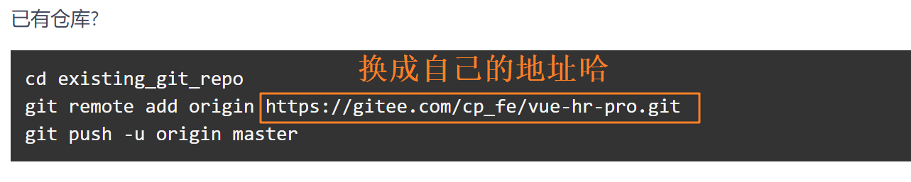

```bash
git remote add origin https://gitee.com/cp_fe/vue-hr-pro.git
```

6）提交代码并推送远程

```bash
git add . 
git commit -m "项目初始化"
git push -u origin master
```

## 4. 项目关键文件介绍

**`本节任务:`** 明确项目中关键文件的作用和项目的简要运行机制

### 应用入口 - main.js

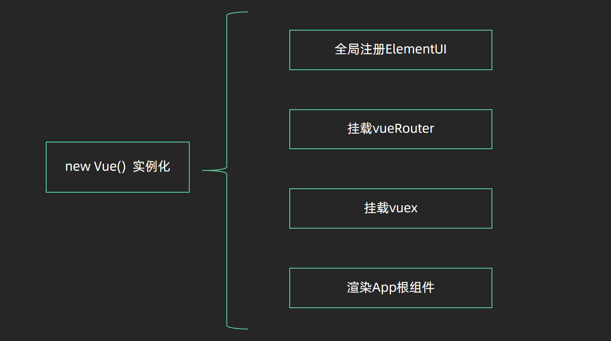

### 项目根组件 - App.vue

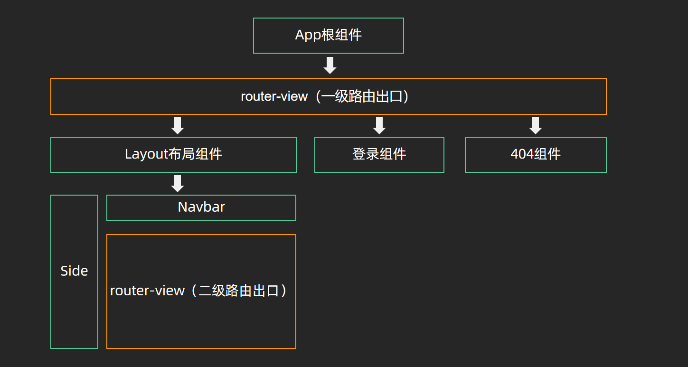

### 权限配置文件 - permission.js

**`permission.js`** 是编写各种权限逻辑的模块，其中包括路由跳转权限，菜单权限控制等，后面我们的权限控制需求都会写到这个文件中，并且让权限控制在应用启动的时候就开启生效

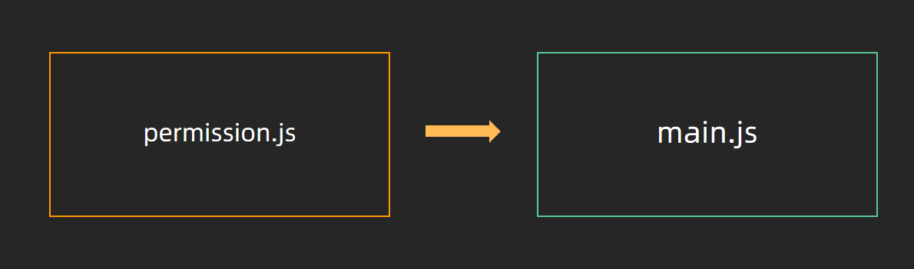

### 集中状态管理 - vuex 

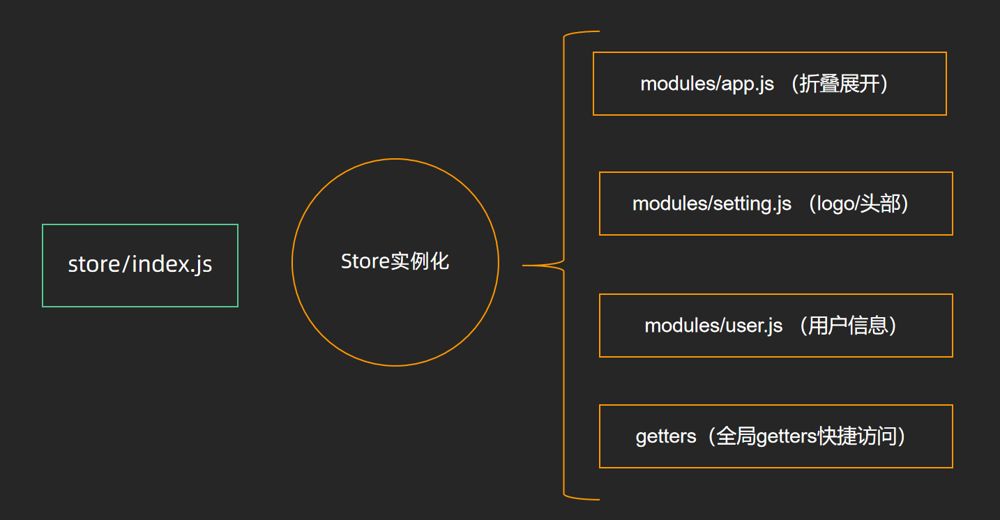


### 图标字体 - icons

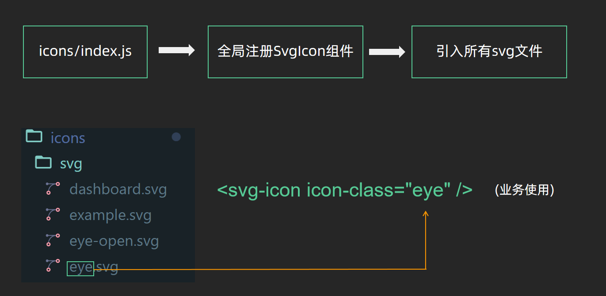

图标字体我们需要掌握的重点是，如果想要渲染自己的svg图标，需要做两件事情

1. 把自己的图标放到特定的文件夹`icons/svg` 下面
2. 通过全局组件`svg-icon` 以如下格式进行使用，重点是svg图标名称的匹配

```html
<svg-icon icon-class="svg图标的名称"/>
```

## 5. SCSS使用

**`本节任务:`** 学习scss预处理器的基础语法

> scss和less都属于css预处理器，比原生css要强大很多，我们通过工资管理模块来测试一下scss的基础常用用法

### 使用变量

`scss`使用`$`符号来标识变量 

```bash 
$highlight-color: #f90;    
```

上面我们声明了一个 名为**`$highlight-color`**的变量，我们可以把该变量用在任何位置，达到复用的目的

```scss
// 定义scss变量
$hight-color:#f90;
.salary-container {
  margin: 30px;
  font-size: 30px;
  line-height: 46px;
  // 使用变量
  color: $hight-color;
}
```

以空格分割的多属性值也可以标识变量

```bash
$basic-border: 1px solid black;
```

```scss
// 定义scss变量
$hight-color:#f90;
$basic-border: 1px solid #ccc;
.salary-container {
  margin: 30px;
  font-size: 30px;
  line-height: 46px;
  // 使用变量
  color: $hight-color;
  border: $basic-border;
}
```

我们再来看一下模板中的 **`styles/variables.scss`**，这个文件中就是我们本次项目用到的所有scss变量

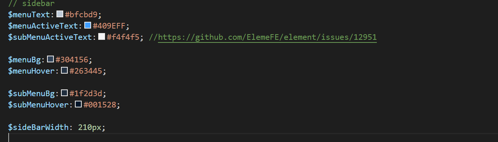

### 嵌套语法

和less一样，scss同样支持**`嵌套型`**的语法，嵌套语法可以保持和html一样的嵌套结构，更好理解

```scss
// 定义scss变量
$hight-color:#f90;
$basic-border: 1px solid #ccc;
.salary-container {
  margin: 30px;
  line-height: 46px;
  // 使用变量
  border: $basic-border;
  .salary-text{
    color: $hight-color;
  }
}
```

&选择符

比如想给当前元素在嵌套的语法下添加一个hover的效果，可以这样来写

```scss
.salary-text{
    color: $hight-color;
    &:hover{
      color: red;
    }
}
```

### 模块引入

我们在`styles` 目录下定义好了很多scss文件，可以在当前组件中的style语法块中导入使用，完成模块化的使用

```scss
// 导入scss模块
@import '@/styles/variables.scss';
.salary-container {
  border: $basic-border;
  .salary-text{
    color: $hight-color;
    &:hover{
      // 使用导入模块中的变量
      color: $subMenuHover;
    }
  }
}
```

## 6. request模块说明

**`本节任务:`** 可以说清楚request模块中对axios做了哪些事情

> 一般的项目都需要和后端进行接口交互，而axios又是使用频率最高的一个网络请求库，通常都会对axios做一定的封装处理，核心的部分有三个
>
> 1. 创建axios实例
> 2. 请求拦截器
> 3. 响应拦截器
>
> 参考网站：https://www.axios-http.cn/

`utils/request.js`

```js
// 创建了一个新的axios实例
const service = axios.create({
  baseURL: process.env.VUE_APP_BASE_API, // url = base url + request url
  timeout: 5000 // 超时时间
})

// axios的请求拦截器
service.interceptors.request.use(
  config => {
    return config
  },
  error => {
    return Promise.reject(error)
  }
)

// 响应拦截器
service.interceptors.response.use(
  // http状态码 200 - 300
  response => {
     return response
  },
  error => {
    return Promise.reject(error)
  }
)

export default service
```

## 7. api模块说明

**`本节任务:`** 熟悉API模块的封装模式和好处

**1. 如何封装接口 - `api/user.js`**

> 整个API目录下会按照不同业务模块单独拆分出js文件，每个js文件里维护对应业务的所有接口，另外在里面我们通过封装一个一个的小函数，使用方只需要传过来接口参数即可

```js
import request from '@/utils/request'

export function login(data) {
  return request({
    url: '/vue-admin-template/user/login',
    method: 'post',
    data
  })
}
```

**2. 如何使用API中的接口函数**

> 每个函数的执行结果都是一个promise对象，在这里的执行结果是一个promise对象，在业务.vue文件中，我们可以非常方便的做接口请求完毕的后续操作

```js
import { login } from '@/api/user'
// 方法一
login().then(res => console.log(res))

// 方法二
async function asyncLogin(){
    const res = await login()
}
```

**2. 封装的好处**

1. 每一个文件就是一个业务对应的所有服务请求接口汇总，清晰明了，查找方便 （方便维护）

2. 任何一个业务组件中如果想使用哪个接口直接导入即可 （方便复用）

3. 语义化清晰，维护方便 （命名即注释）

## 8. 认识端口配置

**`本节目标:`**  掌握本地服务的端口配置

 在**`vue.config.js`**中进行设置

> 如下图，是开发环境服务端口的位置

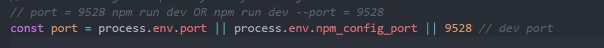

通过配置我们发现，端口号port最终的值由一个或表达式确定，位于最前面的优先，其中的`process.env.port` 就是我们应用配置实际运行端口的地方，这个配置叫做环境变量，只要修改了它，我们就可以针对不一样的前端环境配置不同的端口号

## 9. 认识环境变量

**`本节目标:`**  掌握环境变量的配置

### 环境变量的概念

> 同一个变量名称可以根据环境的不同输出不同的值，就是环境变量

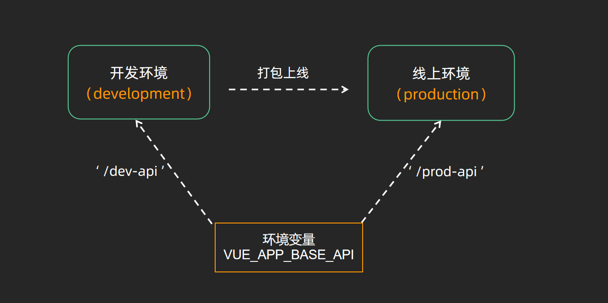

| 文件名称         | 对应环境 | 说明                                                         |
| ---------------- | -------- | ------------------------------------------------------------ |
| .env.development | 开发环境 | 当运行`vue-cli-service serve` 的时候会以此文件为配置文件，这个文件中可以定义针对开发环境的环境变量 |
| .env.production  | 生产环境 | 当运行`vue-cli-service build` 的时候会以此文件为配置文件，这个文件中可以定义针对生产环境的环境变量 |

### 定义并使用

1）定义环境变量采用 `key = value`  的语法进行定义，其中key表示环境变量名称   value表示环境变量值

```bash
# just a flag
ENV = 'development'
# base api
VUE_APP_BASE_API = '/dev-api'
```

2）使用环境变量采用固定的前缀 `process.env.环境变量名`，环境变量名要与定义时的保持一致

```js
process.env.VUE_APP_BASE_API
```

### 客户端使用

> 客户端代码其实就是我们的src目录，如果在这个目录下使用，只能识别 `NODE_ENV`  `BASE_URL` 和以 `VUE_APP_`  打头的环境变量，其它变量不可识别，非客户端代码没有此要求

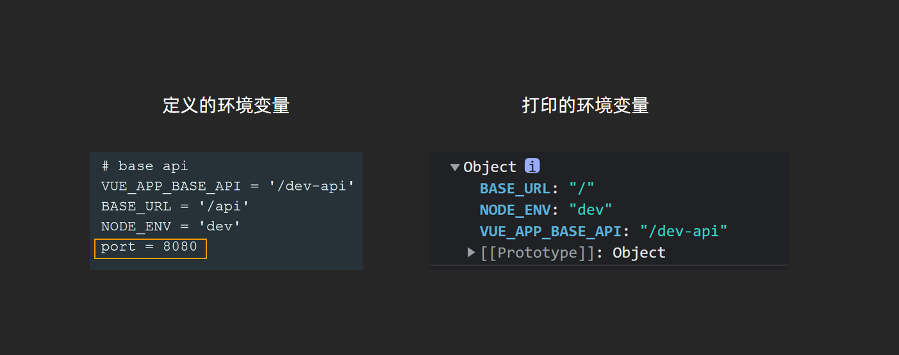

更多阅读：[vue-cli 环境与变量](https://cli.vuejs.org/zh/guide/mode-and-env.html#%E7%8E%AF%E5%A2%83%E5%8F%98%E9%87%8F)


## 10. 今日作业

1. 预习登录模块的功能实现
2. 尝试找到登录模块中的logo图片是如何渲染，为什么要这么写？
