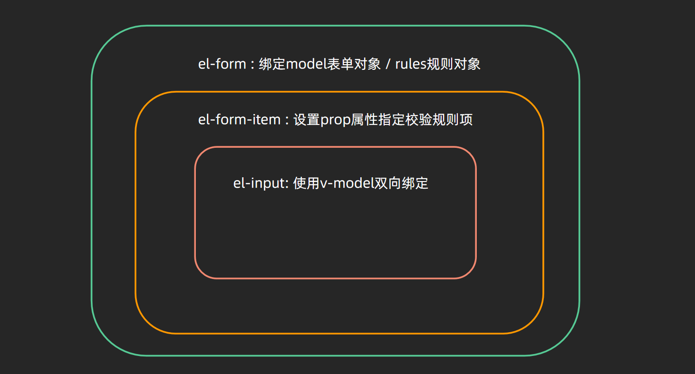
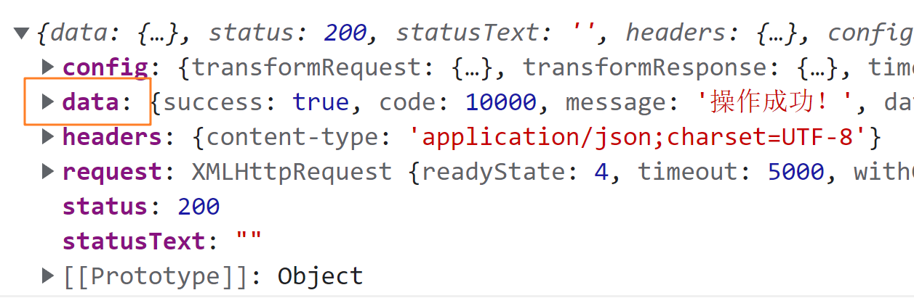
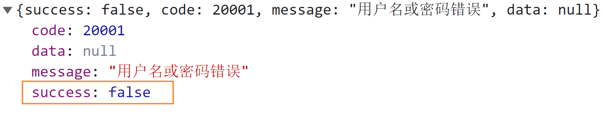
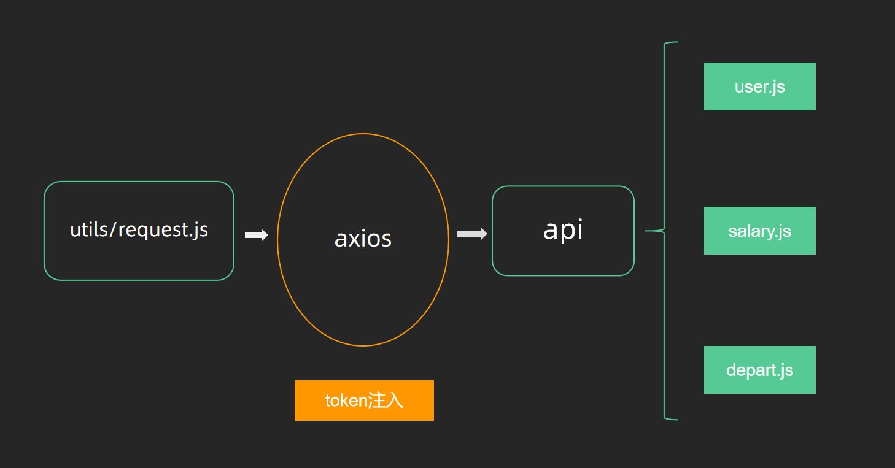

## 1. 表单校验

**`本节目标:`** 对登录表单进行规则校验

### 需求说明

1. 对于用户名进行校验，校验逻辑为：`手机号必填并且格式合法  /^1[3-9]\d{9}$/`
2. 对于密码进行校验，校验逻辑为：`密码为必填项且长度在6-16位之间`

### 思路分析

1. 我们使用的是elementUI组件库，Form表单内置了校验功能，按照文档复用即可
2. 按照需求的校验要求，编写校验逻辑即可



### 核心代码

```vue
<template>
  <!-- 
    必要条件
    el-form: 配置model和rules
    el-form-item: 配置prop
    el-input: 配置v-model 和 name
  -->
   <el-form
      :model="loginForm"
      :rules="loginRules"
    >
      <el-form-item prop="username">
        <el-input
          ref="username"
          v-model="loginForm.username"
          placeholder="Username"
          name="username"
          type="text"
          tabindex="1"
          auto-complete="on"
        />
      </el-form-item>
      <el-form-item prop="password">
        <el-input
          v-model="loginForm.password"
          name="password"
        />
      </el-form-item>
    </el-form>
  </div>
</template>

<script>
export default {
  name: 'Login',
  data () {
    // 校验手机号
    const validateUsername = (rule, value, callback) => {
      if (!/^1[3-9]\d{9}$/.test(value)) {
        callback(new Error('请输入合法的手机号'))
      } else {
        callback()
      }
    }
    return {
      loginForm: {
        username: '',
        password: ''
      },
      loginRules: {
        username: [{ required: true, trigger: 'blur', validator: validateUsername }],
        password: [
          { required: true, trigger: 'blur', message: '密码不能为空' },
          { min: 6, max: 16, message: '长度在 6 到 16 个字符', trigger: 'blur' }
        ]
      }
    }
  }
}
</script>
```

### 经验总结

1. el-form内置了表单的校验，我们需要严格的按照组件的配置要求，组件嵌套关系以及各种参数的配置都不可以写错，否则校验会失败
2. 如果是非常简单的校验逻辑，我们只需要通过简单的配置即可完成，但是如果校验逻辑比较复杂，推荐采取自定义校验函数的写法，因为函数里面可以更加灵活的定义各种逻辑，**千万别忘了调用callback函数**

## 2. 登录基础业务实现

**`本节目标:`** 实现基础登录请求，理解不同环境下的baseURL配置

### 需求分析

1. 点击login按钮做表单兜底统一校验，校验通过实现提交
2. 成功之后弹框提示用户`登录成功`
3. 成功之后跳转到首页

### 思路分析

1. 实现兜底校验需要我们查看elementUI有关el-form组件的文档说明
2. 校验通过之后，需要调用登录接口，我们对照接口文档封装api函数
3. 后续的处理，弹框提示，使用elementUI弹框组件做提示，跳转首页使用路由跳转即可

### 核心代码

1）封装登录接口 - `api/user.js`

```js
/**
 * @description: 登录
 * @param {*} data {mobile, password}
 * @return {*}
 */
export function login(data) {
  return request({
    url: '/sys/login',
    method: 'post',
    data
  })
}
```

2）配置baseURL - `.env.development`

```bash
# 开发环境的基础地址
VUE_APP_BASE_API = 'http://ihrm-java.itheima.net/api'
```

3）在request中设置baseUrl - `utils/index.js`

```js
const service = axios.create({
  // 如果执行 npm run dev  值为  'http://ihrm-java.itheima.net/api'
  baseURL: process.env.VUE_APP_BASE_API, // 设置axios请求的基础的基础地址
  timeout: 5000 // 定义5秒超时
})
```

4）登录接口调用 - `Login/index.vue`

```js
handleLogin () {
  this.$refs.loginForm.validate(async valid => {
    if (valid) {
      this.loading = true
      await login(this.loginForm)
      this.$message.success('登录成功')
      this.$router.push({ path: this.redirect || "/" })
      this.loading = false
    }
  })
}
```

### 经验总结

1. 通过现代的前端开发是需要区分环境的，至少会有俩个环境，`开发和生产`  而不同的环境需要配置不同接口基地址，所以我们baseURL不能写死，要根据不同环境进行自动变化
2. 开发环境对应的环境变量文件为 `.env.development`  ，生产环境对应的环境变量为：`.env.production`

## 3. 处理axios响应

**`本节目标:`** 简化接口数据的获取操作，优化axios对于接口出错的逻辑处理

### 问题说明

1）Axios默认会给我们包裹一个data字段，这导致我们每次在业务模块获取数据都需要写`res.data.data`





2）后端自定义了一个标识当前接口成功失败的字段，叫做`success`，而不是通过http状态码是否为2xx-3xx来标识接口是否成功，这和axios拦截器的成功和失败的判断依据是不一致的，会导致一个比较严重的问题，如果接口已经错了，axios依旧走的是成功回调，会导致`不抛出错误`，静默通过




### 思路分析

1. 针对于问题一，我们可以在拦截器中统一`return response.data`

2. 针对于问题二，我们可以在拦截器中做后端自定义状态码判断，如果成功，也就是success字段为true，则`return response.data`

   如果失败，也就是success字段为false，则可以提示一下用户并且手动 return一个 `Promise.reject() `，让错误可以被抛出，不静默通过

### 核心代码

`request.js`

```js
import { Message } from 'element-ui'
// 响应拦截器
service.interceptors.response.use(
  response => {
    // 解构后端字段
    // success: 接口是否成功
    // data: 接口数据
    // message: 接口提示文案
    const { success, data, message } = response.data
    if (success) {
      return data
    } else {
      // 错误提示用户
      Message.warning(message)
      // 手动抛出错误
      return Promise.reject(message)
    }
  },
  error => {
    return Promise.reject(error)
  }
)
```

处理完之后，再次查看我们登陆之后的查看结果，发现打印出来的已经直接是data中的数据了，同时我们可以输入一个错误的手机号，然后进行登录，查看错误是否按照我们的设置成功显示出错误信息

### 经验总结

1. 谨记axios响应拦截器中的成功失败回调是以http状态码作为判断条件进行自动调用，当http状态码为`200-300` 之间，会执行成功回调；当http状态码不在这个区间会执行失败回调
2. 在实际开发的过程中，接口是否成功有时候后端并不是一定以200-300作为接口标准的，他会自定义，此时需要我们前端，根据自定义状态字段，自行处理成功和失败的状态

## 5. vuex管理token

**`本节目标:`** 使用vuex管理登录接口获取到的token数据

### 需求说明

1. 登录成功之后我们拿到了非常重要的用户标识  token，需要找一个地方存起来
2. 使用vuex作为全局store，对token进行统一管理

### 思路分析

1. 既然token在很多地方都会用到，那理当使用vuex进行统一管理
2. 把有关token存取的操作都封装在vuex中做处理，组件只负责触发action函数即可

### 核心代码

`store/modules/user.js`

```js
import { login } from "@/api/user"
export default {
  namespaced: true,
  state: {
    token: ''
  },
  mutations: {
    setToken (state, token) {
      state.token = token
    }
  },
  actions: {
    async fetchLogin (ctx, data) {
      const res = await login(data)
      ctx.commit('setToken', res)
    }
  }
}
```

`pages/Login/index.vue`

```js
// 登录回调
handleLogin () {
  this.$refs.loginForm.validate(async valid => {
    if (valid) {
      this.loading = true
      try {
        await this.$store.dispatch('user/fetchLogin', this.loginForm)
        this.$message.success('登录成功')
        this.$router.push({ path: this.redirect || "/" })
      } catch (error) {
        this.loading = false
      }
    }
  })
}
```

### 经验总结

1. 如果有些数据比如token在很多组件都有可能会用到，那我们建议采取vuex这种集中状态管理工具进行管理

2. 如果我们采取了vuex管理数据，那么和数据相关的所有操作都放到vuex中，包裹同步mutation和异步action

   整个的模式就变成 `vuex到action` ，业务组件中直接触发action函数

3. 另外注意vuex只放置和数据相关的代码，业务代码我们放到业务组件中执行

## 6. 持久化token

### 需求说明

> 刷新浏览器，保持token数据不丢失，持久化
>
> 为什么要进行持久化？
>
> 1. vuex本身存储的方式基于内存的  快  刷新会丢失  和vue有一个很好的配合 方便使用数据
> 2. localStorage/ cookies 基于磁盘的存储   稍慢  刷新不丢失 
>
> 既想要也想要   vuex + 本地存储（ls/cookies）
>
> 技术方案是什么？
>
> 1. 通过调用接口拿到token，一式俩份 vuex存一份  本地ls/cookies存一份
> 2. 在初始化token的位置 优先从本地取一步，如果取到就以本地的位置，取不到再初始化为空串

### 思路分析

1. 登录成功获取到token之后一式俩份  在vuex存入一份  在本地(ls/cookie)存一份
3. 初始化的时候优先从本地取一下 如果取到就以取到的为主  如果没有就按照格式要求初始化成空串

### 核心代码

在**`utils/auth.js`**中，基础模板已经为我们提供了**`获取token`**，**`设置token`**，**`删除token`**的方法

```js
import Cookies from 'js-cookie'
const TokenKey = 'hrsaas-ihrm-token' // 设定一个独一无二的key
export function getToken() {
  return Cookies.get(TokenKey)
}

export function setToken(token) {
  return Cookies.set(TokenKey, token)
}

export function removeToken() {
  return Cookies.remove(TokenKey)
}
```

`store/modules/user.js`

```js
import { getToken, setToken, removeToken } from '@/utils/auth'
export default {
  namespaced: true,
  state: {
    token: getToken() || ''
  },
  mutations: {
    setToken(state, token) {
      // 存入vuex
      state.token = token
      // 存入cookie
      setToken(token)
    }
  }
}
```

### 经验总结

1. vuex存储数据的方式是基于内存的，基于内存的特点就是存取速度特别快，而且vuex和vue经过了官方绑定，使用起来又快又方便，但是一旦刷新浏览器就会丢失
2. cookie/localStorage这类本地存储是基于磁盘的，基于磁盘的特点就是存取速度稍慢，但是有持久化的功效，浏览器刷新并不会丢失
3. 基于token的特性，它一定时间内才会失效，所以我们使用vuex配合cookie既可以在应用运行的时候，方便存储使用token，又可以在用户刷新浏览器的时候不丢失

## 7. 请求headers注入token 

**`本节目标:`** 将登陆获取到的token统一注入到接口的请求头headers中 

> token作为我们其它请求的用户标识，我们使用请求拦截器做一下统一处理，让每一个请求的header中都拥有token，后端要求的固定标识 `Bearer token`



**`src/utils/request.js`**

```js
import store from '@/store'
service.interceptors.request.use(config => {
  // 在这个位置需要统一的去注入token
  const token = store.state.user.token
    if (token) {
      config.headers['Authorization'] = `Bearer ${token}`
    }
  return config
}, error => {
  return Promise.reject(error)
}) 
```

