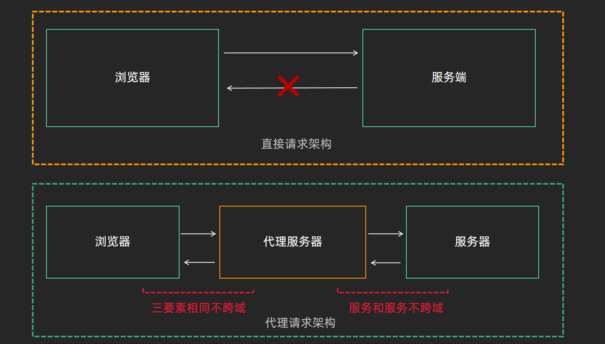

## 1. 跨域问题及解决方案

`本节目标:`  了解跨域问题的主流解决方案

### 跨域原因

由于浏览器同源策略的限制，当前端项目运行的服务地址 和 接口服务运行的地址出现 **协议 域名 端口** 三者有一个不一致就会出现跨域

俩个要素

1. 通过浏览器发起请求
2. 协议 域名 端口 三者存在不同

### 解决方案

| 可选方案              | 使用环境            | 谁来主导     |
| --------------------- | ------------------- | ------------ |
| cors配置              | 生产环境 / 开发环境 | 通常后端配置 |
| 接口代理转发（proxy） | 开发环境            | 通常前端配置 |

## 2. 开发环境下的解决方案

`本节目标:`  学会通过配置vue-cli的proxy代理解决开发环境下的跨域问题

### 方案说明



### 配置说明

`vue.config.js`

```js
module.exports = {
  devServer: {
   // 代理配置
    proxy: {
        // 表示如果我们的请求地址有/api的时候,就出触发代理机制
        // 接口域名发生变化 其余地址保持不变
        '/api': {
            target: '真实接口地址写到这里', // 我们要代理的真实接口地址
            changeOrigin: true // 是否跨域 需要设置此值为true 才可以让本地服务代理我们发出请求
         }
    }
  }
}
```

### 人资代理配置

1）配置`vue.config.js` 

```js
devServer: {
    port: port,
    open: true,
    overlay: {
      warnings: false,
      errors: true
    },
    // 代理跨域的配置
    proxy: {
      // 当我们的本地的请求 有/api的时候，就会代理我们的请求地址向另外一个服务器发出请求
      '/api': {
        target: 'http://ihrm-java.itheima.net/', // 跨域请求的地址
        changeOrigin: true // 只有这个值为true的情况下 才表示开启跨域
      }
    }
}
```

2）修改开发环境配置文件baseURL（**当环境变量中是相对路径的时候，会以当前前端项目启动时的地址拼接相对地址作为请求发起的地址**）

`.env.development`

```BASH
VUE_APP_BASE_API = '/api'
```

3） 验证效果

重新执行 `yarn dev` 重启项目，查看接口调用效果

