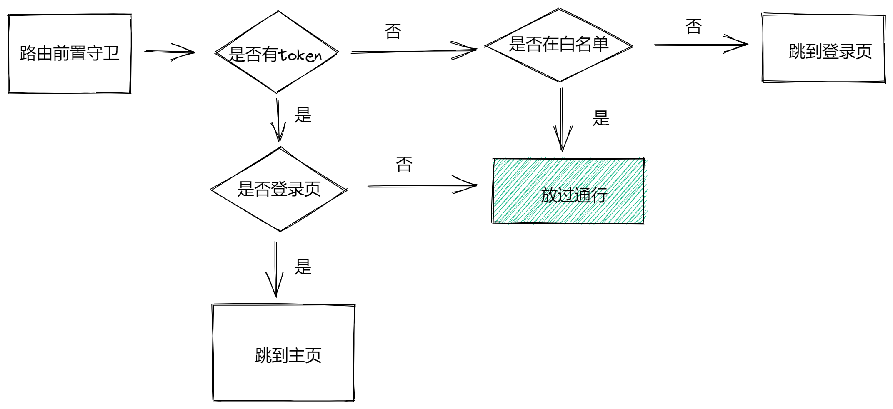

## 1. 路由跳转权限控制

**`本节目标:`** 以用token为核心控制路由页面的跳转（permission.js）

### 需求描述

> 按照如下流程图来控制路由的跳转，其中白名单中包括我们的登录页和404页




### 思路分析

1. 既然是控制应用中所有的路由跳转，可以通过路由前置守卫来做 - `beforeEach`
2. 代码在哪里写呢，路由的跳转也算权限控制的范畴，在`permission.js`模块中进行逻辑编写

### 核心代码

`src/permission.js`

```js
// 这里编写路由权限控制代码
import store from '@/store'
import router from '@/router'
const WHITE_LIST = ['/login', '/404'] // 白名单

router.beforeEach((to, from, next) => {
  if (store.state.user.token) {
    if (to.path === '/login') {
      next('/')
    } else {
      next()
    }
  } else {
    if (WHITE_LIST.includes(to.path)) {
      next()
    } else {
      next('/login')
    }
  }
})
```

### 经验总结

1. 路由前置守卫经常做一些路由跳转控制的事情，因为是全局守卫，所以对于所有的路由都可以拦截的到
2. 回调函数中的三个参数，其中的to参数表示目标路由对象，这个对象中的path属性通常会做为判断条件，next是一个方法，用来`放行路由`，**必须在任何一个分支逻辑中都有next方法执行**，否则有可能出现路由跳转失败

## 2. 进度条控制

### 需求描述

1. 为了增加用户体验，在每次路由跳转时增加进度条控制
2. 进度条在页面的最上方显示

### 思路分析

1. 既然是在路由跳转时增加，那我们编写代码的位置应该放到路由前置守卫里
2. 在守卫的开始处展示进度条，在跳转完毕之后隐藏进度条
3. 查找现成的插件，完成需求 - NProgress   https://github.com/rstacruz/nprogress

### 核心代码

```js
// 这里编写路由权限控制代码
import store from '@/store'
import router from '@/router'
import NProgress from 'nprogress'
import 'nprogress/nprogress.css'
const WHITE_LIST = ['/login', '/404']

router.beforeEach((to, from, next) => {
  // 开启进度条
  NProgress.start()
  if (store.state.user.token) {
    if (to.path === '/login') {
      next('/')
    } else {
      next()
    }
  } else {
    if (WHITE_LIST.includes(to.path)) {
      next()
    } else {
      next('/login')
    }
  }
  // 技术进度条
  NProgress.done()
})
```

### 经验总结

1. 前端的工作中，用户体验也是一个不得忽视的问题，尤其是在异步操作或者页面切换的时候，给到用户一个及时的反馈，能够有效的减少用户的等待焦虑

2. 将来我们的路由控制里还会包含异步请求，此时我们的进度条就很有用了

## 3. 主页内容修改

**`本节目标:`** 按照主页的内容修改代码

> 将下拉菜单调节成**`首页/项目地址/退出登录`**

```vue
<template>
    <div class="right-menu">
      <el-dropdown class="avatar-container" trigger="click">
        <div class="avatar-wrapper">
          
          <span class="name">管理员</span>
          <i class="el-icon-caret-bottom" style="color:#fff" />
        </div>
        <el-dropdown-menu slot="dropdown" class="user-dropdown">
          <router-link to="/">
            <el-dropdown-item>
              首页
            </el-dropdown-item>
          </router-link>
          <a target="_blank" href="https://gitee.com/shuiruohanyu/hrsaas53">
            <el-dropdown-item>
                项目地址
            </el-dropdown-item>
          </a>
          <el-dropdown-item divided @click.native="logout">
            <span style="display:block;">退出登录</span>
          </el-dropdown-item>
        </el-dropdown-menu>
      </el-dropdown>
    </div>
</template>

<style>
 .user-avatar {
  cursor: pointer;
  width: 30px;
  height: 30px;
  border-radius: 15px;
  vertical-align: middle;
}
.name {
  color: #333;
  vertical-align: middle;
  margin-left:5px;
}
.user-dropdown {
   color: #fff;
}
</style>
```

##  4. 用户信息管理

### 需求说明

1. 在跳转到首页时候获取用户个人信息数据，渲染右侧个人名称

### 思路分析

1. 提到用户信息，因为可能在很多模块都需要共享，所以选择vuex管理的方案

   vuex负责管理数据  +  业务组件负责触发action函数

   

2. 用户数据的获取位置很值的思考，其一用户资料的获取依赖于token，其二在跳转首页之后需要立刻获取，其三点击左侧菜单时刷新需要保证用户信息还在，其四用户资料里还包含我们将来要做的菜单权限数据，综上，`最合适触发action函数发送请求的位置就是permisson.js模块中跳转到首页的地方`


### 核心代码

1）在**`src/api/user.js`**中封装获取用户资料的方法

```js
/**
 * @description: 获取用户资料
 * @param {*} token
 * @return {*}
 */
export function getUserInfo() {
  return request({
    url: '/sys/profile',
    method: 'post'
  })
}
```

2）vuex管理数据

```js
import { getUserInfo } from "@/api/user"
export default {
  namespaced: true,
  state: {
    userInfo: {}
  },
  mutations: {
    setUserInfo (state, userInfo) {
      state.userInfo = userInfo
    }
  },
  actions: {
    async fetchUserInfo (ctx) {
      const res = await getUserInfo()
      ctx.commit('setUserInfo',res)
    }
  }
}
```

3）perssion.js中触发action函数

```js
// 这里编写路由权限控制代码

import store from '@/store'
import router from '@/router'
import NProgress from 'nprogress'
import 'nprogress/nprogress.css'
const WHITE_LIST = ['/login', '/404']

router.beforeEach((to, from, next) => {
  // 开启进度条
  NProgress.start()
  if (store.state.user.token) {
    if (to.path === '/login') {
      next('/')
    } else {
      next()
      // 调用action函数 这个位置哦 !!!!!
      store.dispatch('user/fetchUserInfo')
    }
  } else {
    if (WHITE_LIST.includes(to.path)) {
      next()
    } else {
      next('/login')
    }
  }
  // 结束进度条
  NProgress.done()
})
```

## 5. 优化重复请求

**`本节目标:`** 能够优化用户信息的重复请求

### 问题说明

> 尝试点击左侧菜单进行路由跳转，然后查看network面板，观察发生了什么？

因为我们触发action函数的代码是写到路由守卫中的，每次切换路由都会去请求一次用户资料，这显然是不合理的

### 如何解决

一旦获取过一次数据之后，我们会把当前的用户数据存入vuex中，所以我们可以加一个判断，判断vuex中是否已经有了用户数据，如果有我们不再触发，没有才触发action函数

```js
// 通过用户id做判断
if (!store.state.user.userInfo.userId) {
   store.dispatch('user/fetchUserInfo')
}
```

### 经验总结

这个事情如果我们不做会有很大的影响吗，貌似不会，避免重复的请求也属于网络性能优化的一部分

## 6. 获取用户头像

**`本节目标:`**  能够把用户头像拿到并和其它信息合并

### 需求描述

1. 把用户头像获取到在右上角的位置显示

### 思路分析

1. 用户头像也属于用户信息数据，但是后端放到了俩个接口中，我们同样通过vuex维护
2. vuex中已经存在了一个对于用户数据管理的架子，那我们只需要添加一个获取头像的请求然后合并数据即可

### 核心代码

1）封装接口

```js
/**
 * @description: 获取用户头像
 * @param {*} id 用户id
 * @return {*}
 */
export function getUserDetailById(id) {
  return request({
    url: `/sys/user/${id}`
  })
}
```

2）修改action，增加接口，合并数据

```js
actions: {
    async fetchUserInfo (ctx) {
      const res = await getUserInfo()
      const detailRes = await getUserDetailById(res.userId)
      ctx.commit('setUserInfo', { ...res, ...detailRes })
    }
}
```

3）渲染用户头像

```html
 
```

### 经验总结

1. 后端不总是按照我们方便的形式返回数据，甚至会拆分很多的接口，我们需要具备组合接口数据的能力
2. 如果一个接口对另外一个接口有依赖，需要借助同步await的写法，注意接口先后返回数据的顺序

## 7. getters优化

**`本节目标:`**  使用全局getters做快捷映射，简化使用

`getters.js`

```js
const getters = {
  name: state => state.user.userInfo.username,
  avatar: state => state.user.userInfo.staffPhoto
}
export default getters
```

`Layout/components/Navbar.vue`

```html
<div class="avatar-wrapper">
  
  <span>{{ name }}</span>
  <i class="el-icon-caret-bottom" />
</div>
<script>
 computed: {
    ...mapGetters([
      'sidebar',
      'name',
      'avatar'
    ])
  }
</script>
```

## 8. 用户登出实现

**`本节目标:`** 实现用户登出需求

### 需求描述

1. 点击右上角下拉框中的退出登录实现退出功能
2. 先提示用户是否确认退出登录，如果用户选择是，则进行退出逻辑操作

### 思路分析

1. 提示用户是否确认退出登录可以采用elementUI的确认弹框
2. 退出登录需要做的事情其实就是清空用户数据并且跳回到登录页
3. 用户数据包括我们的token和userInfo两部分
4. 跳转回去的时候还需要携带当前是在哪里退出的，将来重新登录还可以跳回来

### 核心代码

1）封装mutation函数

`store/modules/user.js`

```js
mutations: {
   removeUserInfo (state) {
      // 清除vuex
      state.token = ''
      state.userInfo = {}
      // 清除本地
      removeToken()
    }
}
```

2）业务组件触发mutation

`layout/components/Navbar.vue`

```js
async logout () {
  this.$confirm('是否确定退出登录?', '提示', {
    confirmButtonText: '确定',
    cancelButtonText: '取消',
    type: 'warning'
  }).then(() => {
    // 调用mutation函数
    this.$store.commit('user/removeUserInfo')
    // 跳转登录
    this.$router.push(`/login?redirect=${this.$route.fullPath}`)
  })
}
```

## 9. Token失效处理

**`本节目标:`**  掌握针对token失效场景进行处理

### 需求说明

token作为用户的关键令牌信息不是长久有效的，一般都会有一个失效时间，如果超过失效时间，当前token就不能再作为用户标识请求数据了，这时候我们需要做一些额外的失效处理，如果发现token已经失效就跳转登录并且清空用户过期 的数据

### 思路分析

1. 通常token失效之后，我们访问一个接口会报一个 `401`的状态码，可以作为我们判断的条件

2. 应用中任何一个时刻，调用任何一个接口都有可能发生token失效的情况，为了能监控到所有的接口，采取axios响应拦截器处理

### 核心代码

**`src/utils/request.js`**

```js
error => {
   if (error.response.status === 401) {
      // 1. 清理失效的数据
      store.commit('user/removeUserInfo')
      // 2. 跳回到登录
      router.push(`/login?redirect=${router.currentRoute.fullPath}`)
    }
  return Promise.reject(error)
}
```

### 经验总结

1. token作为关键的鉴权数据，通常会有一定的有效时间，几小时作用，如果用户一直在操作，就会一直自动续时
2. token失效之后，后端会配合返回一个401状态码，前端可以把这个状态码作为判断条件

