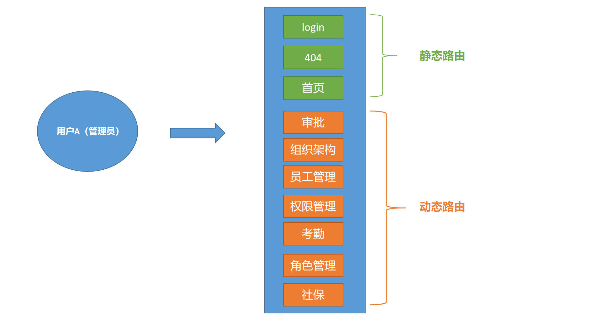
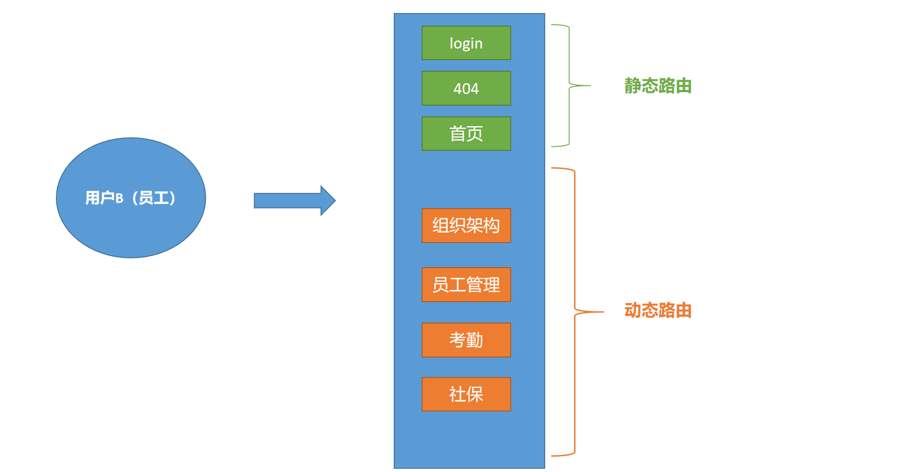

## 1. 动静结合路由管理

**`本节任务:`**  理解静态路由和动态路由的区别，并且理解动态结合静态的路由管理方式

### 概念理解

> 静态路由：不需要做权限控制的路由，每个用户都可以正常访问
>
> 动态路由：需要做权限控制的路由，用户如果权限不一致能够访问到的路由也不一样






通过俩个不同权限的用户说明，我们发现，标记了绿色的是静态路由，标记了橙色的动态路由，静态路由不随着不同用户而发生变化，而动态路由随着用户的权限能访问的个数也不一样

### 拆分静态和动态路由

```js
// 动态路由
export const asyncRoutes = [
  {
    path: '/salary',
    component: Layout,
    children: [{
      path: '',
      name: 'Salary',
      component: () => import('@/views/Salary/index'),
      meta: { title: '工资管理', icon: 'dashboard' }
    }]
  }
]

// 静态路由
export const constantRoutes = [
  {
    path: '/login',
    component: () => import('@/views/Login/index'),
    hidden: true
  },

  {
    path: '/404',
    component: () => import('@/views/404'),
    hidden: true
  },

  {
    path: '/',
    component: Layout,
    children: [{
      path: '',
      name: 'Dashboard',
      component: () => import('@/views/Dashboard/index'),
      meta: { title: 'DashBoard', icon: 'dashboard' }
    }]
  },

  // 404 page must be placed at the end !!!
  { path: '*', redirect: '/404', hidden: true }
]

const createRouter = () => new Router({
  scrollBehavior: () => ({ y: 0 }),
  routes: [...constantRoutes, ...asyncRoutes]
})
```

### 路由总结

1. 现在虽然在显示上和未拆分之前没有什么不同，但是概念上依旧分成了俩个数组，他们是独立维护的
2. 拆分到动态路由列表中的数组，将来我们做权限控制的时候就可以作为 筛选的 `原料`

## 2. 准备所有动态路由

**`本节任务:`**  把所有的动态路由都统一配置好

把 `项目资源`中的views目录下的所有文件夹复制到我们自己项目中的`views` 目录下，然后配置到路由系统中

1）配置所有动态路由表 - `router/asyncRoutes.js`

```js
// 动态路由
export const asyncRoutes = [
  // 工资管理
  {
    path: '/salary',
    component: Layout,
    children: [{
      path: '',
      name: 'Salary',
      component: () => import('@/views/Salary/index'),
      meta: { title: '工资管理', icon: 'dashboard' }
    }]
  },
  // 组织架构
  {
    path: '/department',
    component: Layout,
    children: [{
      path: '',
      name: 'department',
      component: () => import('@/views/Department/index'),
      meta: { title: '组织架构', icon: 'dashboard' }
    }]
  },
  // 权限点
  {
    path: '/permission',
    component: Layout,
    children: [{
      path: '',
      name: 'permission',
      component: () => import('@/views/Permission/index'),
      meta: { title: '权限点管理', icon: 'dashboard' }
    }]
  },
  // 员工管理
  {
    path: '/employee',
    component: Layout,
    children: [{
      path: '',
      name: 'employee',
      component: () => import('@/views/Employee/index'),
      meta: { title: '员工管理', icon: 'dashboard' }
    }]
  },
   // 角色管理
  {
    path: '/setting',
    component: Layout,
    children: [{
      path: '',
      name: 'setting',
      component: () => import('@/views/Setting/index'),
      meta: { title: '角色管理', icon: 'setting' }
    }]
  }
]
```

2）加入到路由配置项中 `router/index.js`

```js
import { asyncRoutes } from './asyncRoutes'
```

## 3. 理解菜单生成逻辑

**`本节任务`**： 理解左侧导航菜单是如何渲染出来

**问题1：为什么路由表里添加了新路由就会显示到左侧？**

`layout/SideBar/index.vue`

```html
<template>
  <sidebar-item 
     v-for="route in routes" 
     :key="route.path" 
     :item="route" 
     :base-path="route.path" 
  />
</template>

<script>
  export default {
    computed: {
      routes() {
         // this.$router.options.routes可以拿到完整的路由表数据
         return this.$router.options.routes
      }
    }
  }
</script>
```

通过分析源码我们得知

1. 项目左侧的菜单时根据完整的路由表遍历出来的，并且我们学习了一个新的属性 `this.$router.options.routes` 可以拿到完整的路由表数据

2. 负责菜单标题渲染的是meta属性中的title属性，负责图标渲染的是meta中的icon属性

   

**问题2：为什么404/login路由没有显示到左侧菜单中？**

```js
{
    path: '/login',
    component: () => import('@/views/login/index'),
    hidden: true
 },

 {
    path: '/404',
    component: () => import('@/views/404'),
    hidden: true
 }
```

这里面有一个属性叫做 `hidden:true` 

## 4. 设置菜单图标

**`本节任务:`** 给每个菜单配置前面菜单图标

### 理解配置思路

 `Layout/SideBar/SideBarItem.vue`


1. 左侧菜单的文字读取的是meta属性的title属性

2. 左侧菜单的图标读取的是meta属性的icon属性，meta的icon属性名匹配`src/icons`目录下的svg图标名称即可显示图标

### 修改步骤

1）拷贝svg图标到项目中

该资源已经在资料svg目录中提供，请将该目录下的所有svg放到**`src/icons/svg`**目录下

2）修改路由中的icon名字

| 模块名     | icon名     |
| ---------- | ---------- |
| Dashboard  | dashboard  |
| Department | tree       |
| Employee   | people     |
| Setting    | setting    |
| Salary     | money      |
| Social     | table      |
| Permission | lock       |
| Approval   | tree-table |
| Attendance | skill      |

```js
{
  path: '/departments',
  component: Layout,
  children: [
    {
      path: '',
      name: 'departments',
      component: () => import('@/views/departments'),
      meta: { title: '组织架构', icon: 'tree' }
    }
  ]
}
```

## 5. 调整业务菜单顺序

我们人资项目的核心业务模块有以下四个

- 组织架构 （公司的人员架构）
- 角色管理  （角色管理）
- 员工管理  （给员工分配角色）
- 权限点管理 （配置各种权限点）

按照以上顺序，我们调整一下菜单的顺序 - `router/ asyncRoutes.js`

```js
import Layout from '@/layout'
// 动态路由
export const asyncRoutes = [
  // 组织架构
  {
    path: '/department',
    component: Layout,
    children: [{
      path: '',
      name: 'department',
      component: () => import('@/views/Department/index'),
      meta: { title: '组织架构', icon: 'tree' }
    }]
  },
  // 角色管理
  {
    path: '/setting',
    component: Layout,
    children: [{
      path: '',
      name: 'setting',
      component: () => import('@/views/Setting/index'),
      meta: { title: '角色管理', icon: 'setting' }
    }]
  },
  // 员工管理
  {
    path: '/employee',
    component: Layout,
    children: [{
      path: '',
      name: 'employee',
      component: () => import('@/views/Employee/index'),
      meta: { title: '员工管理', icon: 'people' }
    }]
  },

  // 权限点
  {
    path: '/permission',
    component: Layout,
    children: [{
      path: '',
      name: 'permission',
      component: () => import('@/views/Permission/index'),
      meta: { title: '权限点管理', icon: 'lock' }
    }]
  },
  // 工资管理
  {
    path: '/salary',
    component: Layout,
    children: [{
      path: '',
      name: 'Salary',
      component: () => import('@/views/Salary/index'),
      meta: { title: '工资管理', icon: 'money' }
    }]
  }
]
```

