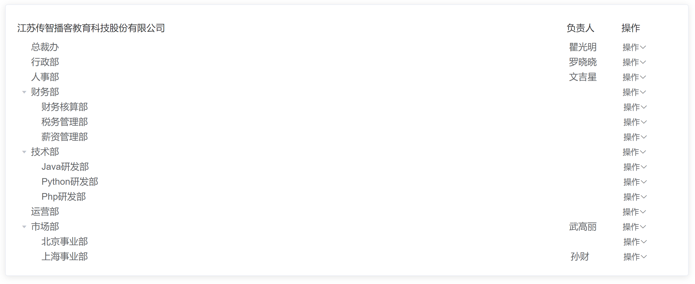
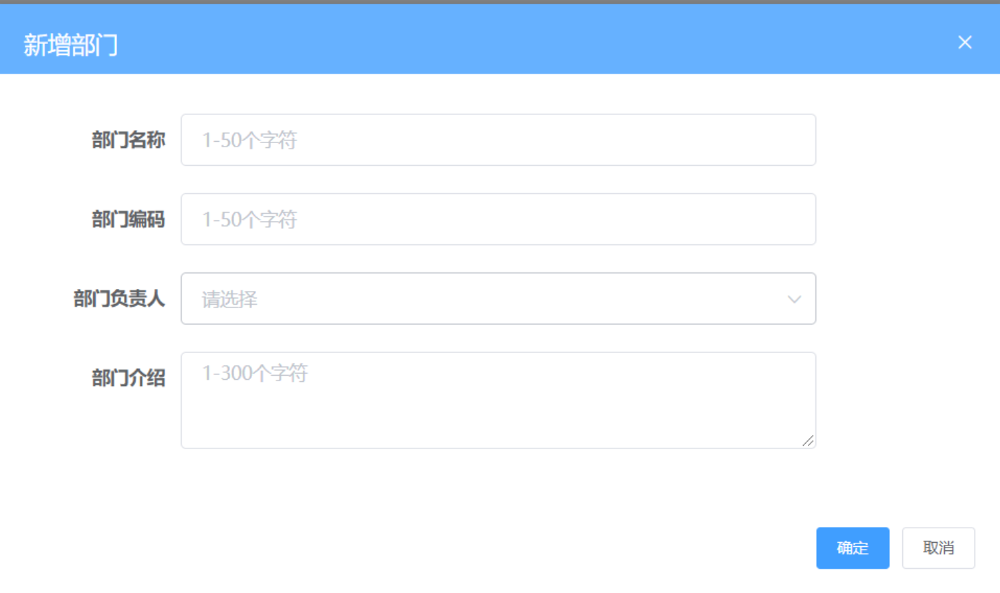
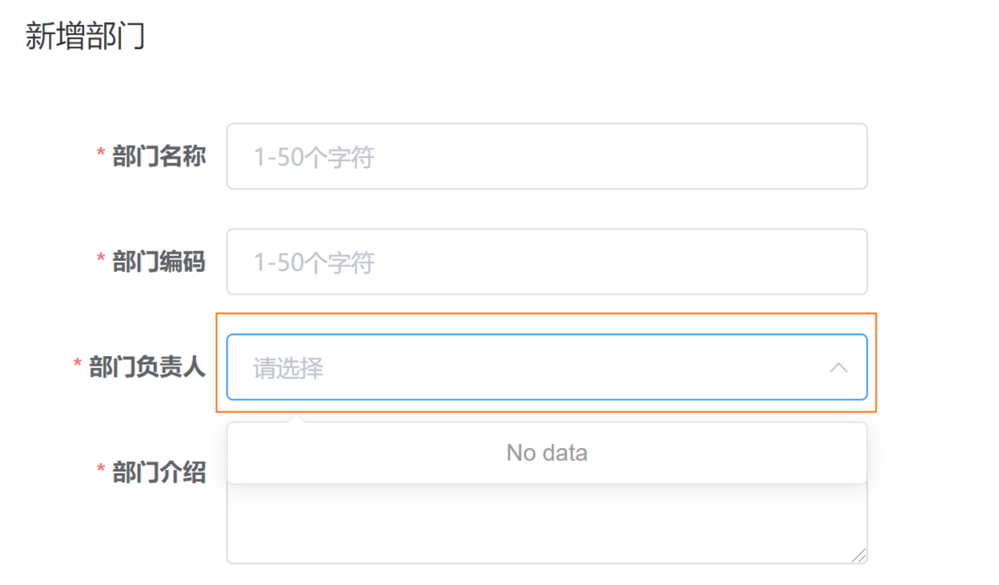
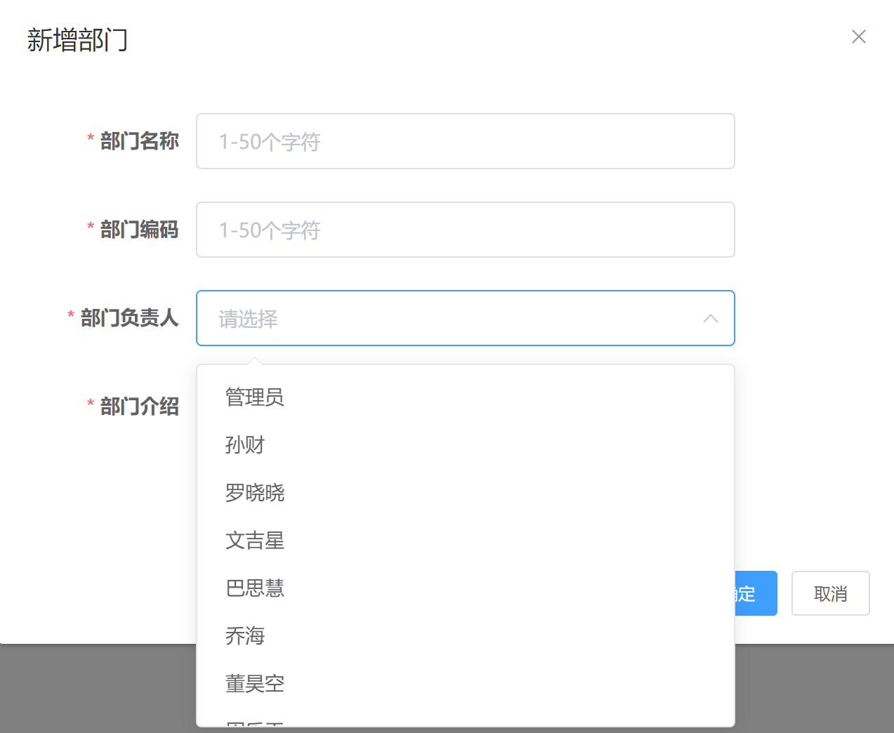
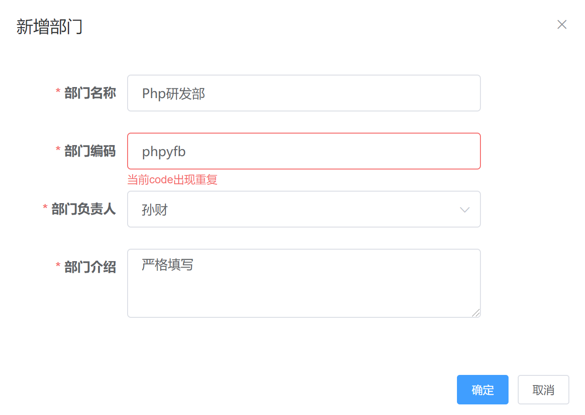

## 1. 树形结构布局

**`本节任务:`  **使用element-UI组件布局组织架构的基本布局

### 理解布局需求



### 实现基础布局

1）实现头部布局

```html
<template>
  <div class="department-container">
    <div class="app-container">
      <el-card>
          <!-- 用一个行列布局 -->
          <el-row type="flex" justify="space-between" align="middle" style="height: 40px">
            <el-col :span="20">
              <span>江苏传智播客教育科技股份有限公司</span>
            </el-col>
            <el-col :span="4">
              <el-row type="flex" justify="end">
                <!-- 两个内容 -->
                <el-col>负责人</el-col>
                <el-col>操作</el-col>
              </el-row>
            </el-col>
          </el-row>
      </el-card>   
    </div>
  </div>
</template>
```

2）实现树形tree布局

> 1. 树形组件依赖一份结构为树形嵌套的数据结构
> 2. data 中默认 `label` 为节点标签的文字，`children` 为子节点  (可以通过 props 修改默认配置 )

```html
<!-- 放置一个el-tree组件 -->
<el-tree :data="list"/>

<script>
export default {
  data() {
    return {
      // 依赖一份树形数据
      list: [{
        label: '财务部',
        children: [
          {
            label: '财务核算部'
          },
          {
            label: '税务核算部'
          }
        ]
      }]
    }
  }
}
</script>
```

### 修改默认配置

> 如果后端给到我们的数据字段名称不叫label和children，我们也可以通过自定义配置去修改

```html
<el-tree :data="list" :props="defaultProps" />

<script>
export defalut {
   data() {
     return {
        list: [{
            name: '财务部',
            children: [
              {
                name: '财务核算部'
              },
              {
                name: '税务核算部'
              }
            ]
        }],
        defaultProps: {
          label: 'name',
          children: 'children'
        }
      }
   }
}
</script>
```

### 展开所有子节点

```html
<!-- 凡是需要配置需要适配具体数据类型的属性必须加上冒号-->
<el-tree
    :data="list"
    :props="defaultProps"
    :default-expand-all="true"
/>
```

### 添加自定义结构

```html
<el-tree
    :data="list"
    :props="defaultProps"
    :default-expand-all="true"
  >
    <!-- 作用域插槽 data拿到的是每一个子节点的对象 -->
    <template #default="{ data }">
      <el-row
        type="flex"
        justify="space-between"
        align="middle"
        style="height: 40px; width: 100%;"
      >
        <el-col :span="20">
          <span>{{ data.name }}</span>
        </el-col>
        <el-col :span="4">
          <el-row type="flex" justify="end">
            <!-- 两个内容 -->
            <el-col>{{ data.manager }}</el-col>
            <el-col>
              <!-- 下拉菜单 element -->
              <el-dropdown>
                <span> 操作<i class="el-icon-arrow-down" /> </span>
                <el-dropdown-menu slot="dropdown">
                  <el-dropdown-item>添加子部门</el-dropdown-item>
                  <el-dropdown-item>编辑部门</el-dropdown-item>
                  <el-dropdown-item>删除部门</el-dropdown-item>
                </el-dropdown-menu>
              </el-dropdown>
            </el-col>
          </el-row>
        </el-col>
      </el-row>
    </template>
 </el-tree>
```

## 2. 渲染组织架构数据

**`本节任务:`** 获取真实的接口数据，渲染静态树形结构

**实现思路**

1. 在API模块中封装获取数据的接口
2. 组件的data中声明响应式数据和请求数据的方法
3. 调用接口获取数据并渲染模块

**代码落地**

`src/api/department.js`

```js
export function getDepartments() {
  return request({
    url: '/company/department'
  })
}
```

`views/Department/index.vue`

```js
// 引入接口
import { getDepartments } from '@/api/departments'

// 准备响应式数据
data(){
    return {
        treeList:[]
    }
}
// 封装专门的method函数
methods: {
  async fetchDepartment() {
      const res = await getDepartments()
      this.treeList = res.depts
  }
},
// 调用method函数
mounted() {
  this.fetchDepartment()
}
```

根据渲染结构，我们发现，虽然数据已经成功显示出来了，但是它是平铺下来的，并不是树形的，这是因为后端返回来的数据并不是一个嵌套的数组结构，而是一个平铺的数组结构，需要我们自行处理一下

## 3. 树形结构数据处理

**`本节任务:`** 把后端返回的平铺数组数据处理为tree组件需要的树形数据

> 核心思路就是寻找父节点 https://chaichai-fe.github.io/show-tree/

定义转换函数   **`src/utils/index.js`**

```js
export function transTree(souceData) {
  const targetData = []
  // 以每一项的id作为key,自身作为value形成对象结构
  const map = {}
  souceData.forEach(item => {
    map[item.id] = item
    item.children = []
  })
  // 遍历数组通过pid去匹配id,匹配到就添加到chilren属性中,匹配不到代表自身就是最外层的父节点,添加到最终的数组中
  souceData.forEach(item => {
    if (map[item.pid]) {
      // 匹配上
      map[item.pid].children.push(item)
    } else {
      // 没有匹配上
      targetData.push(item)
    }
  })
  // 返回的是处理之后的数组
  return targetData
}
```

赋值之前先处理数据  

```js
async fetchDepartment() {
  const res = await getDepartments()
  this.treeList = transTree(res.depts)
}
```

## 4. 删除部门功能实现

**`本节任务:`** 实现操作功能的删除功能

**实现思路**

1. 封装删除部门的API接口
2. 危险操作  询问用户是否确定删除 （confirm）
3. 调用删除接口 （id）
4. 处理删除之后的后续逻辑 （更新列表 / 提示用户）

**代码落地**

1）封装接口 **`src/api/departments.js`**

```js
/**
 * @description: 删除部门
 * @param {*} id 当前点击的操作按钮 所在的项的id
 * @return {*}
 */
export function delDepartments(id) {
  return request({
    url: `/company/department/${id}`,
    method: 'delete'
  })
}
```

2）实现删除逻辑

```html
<!-- 下拉菜单 -->
<el-dropdown-menu slot="dropdown">
  <el-dropdown-item>添加子部门</el-dropdown-item>
  <el-dropdown-item>编辑部门</el-dropdown-item>
  <el-dropdown-item @click.native="delPart(data.id)">删除部门</el-dropdown-item>
</el-dropdown-menu>

<script>
    import { delDepartments } from '@/api/departments'
    export default {
      methods:{
        delDepartment (id) {
          this.$confirm('你确认要进行删除么?', '温馨提示').then(async() => {
            // 删除操作成功
            await delDepartments(id)
            // 删除成功后续操作
            this.$message.success('删除操作成功')
            this.fetchDepartment()
          })
        }
      }
    }
</script>
```

## 5. 新增部门-弹框实现

**`本节任务:`** 实现新增部门的弹框打开关闭交互


> el-dialog组件，我们注意尽量不使用.sync语法糖，这是一个被废弃的语法，我们还是通过监听 组件的close事件，在事件的回调函数中手动修改属性控制弹框关闭

```vue
<template>
    <el-dialog
      title="新增部门"
      :visible="addVisible"
      width="30%"
      @close="closeAddDialog"
    >
      <span>这是一段信息</span>
      <span slot="footer" class="dialog-footer">
        <el-button @click="addVisible = false">取 消</el-button>
        <el-button type="primary" @click="addVisible = false">确 定</el-button>
      </span>
    </el-dialog>
</template>
<script>
export default {
   data(){
       return {
            addVisible: false
       }
   },
   methods:{
        // 打开弹框
        openAddDialog() {
          this.addVisible = true
        },
        // 关闭弹框
        closeAddDialog() {
          this.addVisible = false
        }
   }
}
</script>
```

## 6. 新增部门-业务实现

###  准备表单并进行校验

**`本节任务: `** 实现新增部门的页面结构搭建和基础表单校验

**基础思路**

1. 准备表单结构
2. 按照业务需求添加校验

**代码落地**

1）准备页面结构



```vue
<template>
  <!-- 新增部门的弹层 -->
  <el-dialog title="新增部门" :visible="dialogVisible">
    <el-form label-width="120px">
      <el-form-item label="部门名称">
        <el-input style="width:80%" placeholder="1-50个字符" />
      </el-form-item>
      <el-form-item label="部门编码">
        <el-input style="width:80%" placeholder="1-50个字符" />
      </el-form-item>
      <el-form-item label="部门负责人">
        <el-select style="width:80%" placeholder="请选择" />
      </el-form-item>
      <el-form-item label="部门介绍">
        <el-input style="width:80%" placeholder="1-300个字符" type="textarea"/>
      </el-form-item>
    </el-form>
    <template #footer>
      <el-button type="primary" size="small">确定</el-button>
      <el-button size="small">取消</el-button>
    </template>
  </el-dialog>
</template>
```

2）表单基础校验

| 校验项目              | 校验规则         |
| --------------------- | ---------------- |
| 部门名称（name）      | 必填 1-50个字符  |
| 部门编码（code）      | 必填 1-50个字符  |
| 部门负责人（manager） | 必填             |
| 部门介绍 ( introduce) | 必填 1-300个字符 |

```html
<template>
    <el-form ref="deptForm" :model="form" :rules="rules" label-width="120px">
      <el-form-item label="部门名称" prop="name">
        <el-input v-model="form.name" style="width:80%" placeholder="1-50个字符" />
      </el-form-item>
      <el-form-item label="部门编码" prop="code">
        <el-input v-model="form.code" style="width:80%" placeholder="1-50个字符" />
      </el-form-item>
      <el-form-item label="部门负责人" prop="manager">
        <el-select v-model="form.manager" style="width:80%" placeholder="请选择" />
      </el-form-item>
      <el-form-item label="部门介绍" prop="introduce">
        <el-input v-model="form.introduce" style="width:80%" placeholder="1-300个字符" type="textarea" :rows="3" />
      </el-form-item>
    </el-form>
</template>

<script>
 export default {
    data(){
      return {
       form: {
            name: '', // 部门名称
            code: '', // 部门编码
            manager: '', // 部门管理者
            introduce: '' // 部门介绍
        },
        rules: {
            name: [
              { required: true, message: '部门名称不能为空', trigger: ['blur', 'change'] },
              { min: 1, max: 50, message: '部门名称要求1-50个字符', trigger: ['blur', 'change'] }
            ],
            code: [
              { required: true, message: '部门编码不能为空', trigger: ['blur', 'change'] },
              { min: 1, max: 50, message: '部门编码要求1-50个字符', trigger: ['blur', 'change'] }
            ],
            manager: [
              { required: true, message: '部门负责人不能为空', trigger: ['blur', 'change'] }
            ],
            introduce: [
              { required: true, message: '部门介绍不能为空', trigger: ['blur', 'change'] },
              { min: 1, max: 300, message: '部门介绍要求1-300个字符', trigger: ['blur', 'change']}
            ]
         }
      }
  }
</script>
```

### 部门负责人数据处理

**`本节任务`**：获取新增表单中的部门负责人下拉数据



**基础思路**

1. 封装获取员工列表的接口
2. 调用接口获取数据
3. 准备element下拉框组件
4. 按照组件规则渲染数据

**代码落地**

1）封装获取简单员工列表的模块 **`src/api/employees.js`**

```js
import request from '@/utils/request'

/**
 * @description: 获取下拉员工数据
 * @param {*}
 * @return {*}
 */
export function getEmployeeSimple() {
  return request({
    url: '/sys/user/simple'
  })
}
```

2）open事件回调中获取负责人列表

```jsx
<el-dialog @open="openDialog"></el-dialog>

import  { getEmployeeSimple } from '@/api/employees'
export default {
   data(){
       return {
           managerList: []
       }
   },
   openDialog() {
      this.fetchManagerList()
   },
   methods: {
      // 获取员工简单列表数据
        async fetchManagerList() {
          const data = await getEmployeeSimple()
          this.managerList = data
        }
    }
}
```

3）渲染负责人列表

> 下拉框中的value属性将作为选中的值交给v-model绑定的属性

```html
<el-form-item label="部门负责人" prop="manager">
  <el-select v-model="form.manager" style="width:80%" placeholder="请选择">
    <el-option 
        v-for="item in peoples" 
        :key="item.id" 
        :value="item.username" 
        :label="item.username" 
     />
  </el-select>
</el-form-item>
```



### 兜底校验调用接口

**`本节任务`**：对表单进行兜底校验并调用新增接口 

**基础思路**

1. 使用ref获取fom组件实例对象
2. 调用validate方法
3. 校验通过之后调用新增接口

**代码落地**

1）给el-form定义一个ref属性

```vue
<el-form ref="deptForm"></el-form>
```

```js
// 提交
clickSubmit() {
  this.$refs.deptForm.validate(isOK => {
    if (isOK) {
      // 表示可以提交了
    }
  })
}
```

2）封装新增接口

封装新增部门的api模块  **`src/api/departments.js`**

```js
/**
 * @description: 新增子部分
 * @param {*} 
        data { 
            name: '', // 部门名称
            code: '', // 部门编码
            manager: '', // 部门管理者
            introduce: '', // 部门介绍
            pid: '' // 新增子部门给谁 (直接获取不到)
        }
 * @return {*}
 */
export function addDepartments(data) {
  return request({
    url: '/company/department',
    method: 'post',
    data
  })
}
```

3）记录当前点击项id（将来作为pid字段）

> 新增接口所需要的参数 除了pid之外，其它参数都有表单元素产生，pid子组件中没办法直接获取到，需要点击时进行记录

```jsx
data(){
    return {
        curId: ''
    }
},
methods:{
    addDepart(id){
        this.curId = id
    }
}

<el-dropdown-item @click.native="addDepart(data.id)">添加子部门</el-dropdown-item>
```

4）验证通过调用

```js
 // 提交
clickSubmit() {
  this.$refs.deptForm.validate(async isOK => {
    if (isOK) {
      // 表示可以提交了
      await addDepartments({ ...this.form, pid: this.curId })
      // 关闭弹框
    }
  })
}
```

### 后续逻辑实现

**`本节任务:`**实现新增成功之后的后续逻辑处理

> 1. 关闭弹框
> 2. 刷新列表
> 3. 提示用户
> 4. 清空表单和校验痕迹

```js
this.$refs.addForm.validate(async(valid) => {
    if (valid) {
      // 2. 收集表单数据接口调用
      // pid：点击时候确定的 声明一个响应式数据 每次点击时都拿到当前的id 然后放到这个响应式数据中
      await addDepartments({ ...this.form, pid: this.curId })
      // 后续逻辑
      // 1. 关闭弹框
      this.dialogVisible = false
      // 2. 刷新列表
      this.fetchDepartmentList()
      // 3. 提示
      this.$message.success('新增成功')
      // 4. 清空表单
      // 5. 清除校验痕迹
      this.$refs.addForm.resetFields()
    }
 })
```

## 7. 新增部门-额外校验

**`本节任务:`** 实现表单数据的重复性校验

| 校验项目         | 校验规则                         |
| ---------------- | -------------------------------- |
| 部门编码（code） | 部门编码在整个模块中都不允许重复 |

**基础思路**

1. 子组件中获取到所有的原始节点数据（未经过处理，方便操作）
2. 把所有节点的code码组成新数组
3. 判断当前输入的code码是否能在数组中找到 （includes）
4. 如果能找到代表重复，提示错误信息

**代码落地**

```js
// 准备未经过树形处理的原数组
async fetchDepartmentList() {
  const res = await getDepartment()
  // 把一个平铺的数组先处理成组件要求的tree型结构 然后再交给响应式的数据
  this.list = transTree(res.depts)
  // 存一份原始 平铺的未经过处理的数据
  this.sourceList = res.depts
}

const validateCode = (rule, value, callback) => {
  // 1. 拿到所有的原始节点数据  allList
  // 2. allList里面每一项的code码拿到组成一个新数组
  let codeList = this.allList.map(item => item.code)
  if (codeList.includes(value)) {
    return callback(new Error('当前code码重复'))
  } else {
    callback()
  }
}

// 添加自定义校验函数
code: [
  { required: true, message: '部门编码不能为空', trigger: ['blur', 'change'] },
  { min: 1, max: 50, message: '部门编码要求1-50个字符', trigger: ['blur', 'change'] },
  { validator: validateCode, trigger: 'blur' }
]
```

## 8. 编辑功能实现

**`本节任务:`** 对已经创建过的节点做编辑操作

**基础思路**

> 编辑和新建的操作逻辑大部分是通用的逻辑，只是多了一个回显操作，我们在点击编辑按钮的时候，需要做一下事情

1. 打开弹框（复用新增时候的弹框）
2. 记录当前点击项（具体要编辑谁）
3. 获取数据完成回填
4. 进行具体的表单编辑调用更新接口（**根据是否有id做为是否为编辑的判断依据**）

### 打开弹框并回显数据

1）点击编辑打开弹框

```jsx
<el-dropdown-menu slot="dropdown">
  <el-dropdown-item
    @click.native="editDepart(data.id)"
  >编辑部门</el-dropdown-item>
</el-dropdown-menu>
</el-dropdown>

// 编辑
async editDepart(id) {
  // 思路：
  // 1.打开弹框（复用新增弹框）
  this.dialogVisible = true
}
```

2）封装接口

```js
/**
 * @description: 获取部门详情
 * @param {*} id 表示当前要编辑项的id值
 * @return {*}
 */
export function getDepartDetail(id) {
  return request({
    url: `/company/department/${id}`
  })
}
```

3）获取数据

```jsx
import { getDepartDetail } from '@/api/departments'
// 编辑
async editDepart(id) {
  // 思路：
  // 1.打开弹框（复用新增弹框）
  this.dialogVisible = true
  // 2.调用接口数据回填
  const res = await getDepartDetail(id)
  this.form = res
  // 3.在点击确定按钮时,区分当前是否为编辑 新增就调用新增 编辑就调用更新接口
}
```

### 编辑数据进行更新

1）封装更新接口

```js
/**
  * @description: 更新部门数据
  * @param {*} data:form表单数据 但是要有id值
  * @return {*}
  */
export function updateDepartments(data) {
  return request({
    url: `/company/department/${data.id}`,
    method: 'put',
    data
  })
}
```

2）复用兜底校验

```js
confirmAdd() {
  // 先进行兜底校验
  this.$refs.formRef.validate(async(valid) => {
    if (valid) {
      if (this.form.id) {
        // 调用更新接口
        await updateDepartments(this.form)
      } else {
        // 调用新增接口
        await addDepartments({ ...this.form, pid: this.curId })
      }
    }
  })
}
```

### 修复code在编辑时的校验逻辑




> 编辑状态下code出现了重复
> 原因：编辑状态时codeList中已经存在了自己的code
> 思路：codeList在编辑状态下应该去掉当前的自己
> 解决方案：filter 判断条件 codeList中的code 是否和当前自己的code

```js
const validateCode = (rule, value, callback) => {
  // 把一个数组在个数不变的情况下拿到code组成一个新数组 -> map
  // this.form.code 因为双向绑定的关系一直在变
  // 单独拎出来把一开始的JYL单纯存一份 专门用来做判断条件的 不能随着v-model进行变化
  let codeList = []
  if (this.form.id) {
    // 编辑
    codeList = this.sourceList.map((item) => item.code)
      .filter(code => code !== this.cacheCode)
  } else {
    // 新增
    codeList = this.sourceList.map((item) => item.code)
  }
  // 在一个数组中找到某一项 -> includes
  if (codeList.includes(value)) {
    // 找到了 重复了
    return callback(new Error('当前code码出现重复'))
  } else {
    // 没找到
    callback()
  }
}
```
