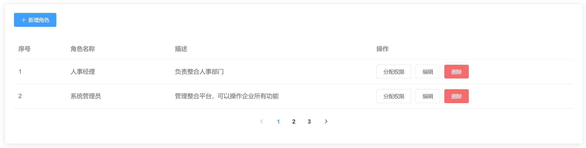
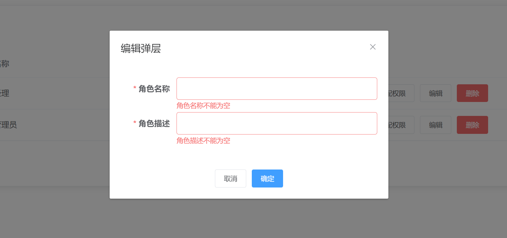
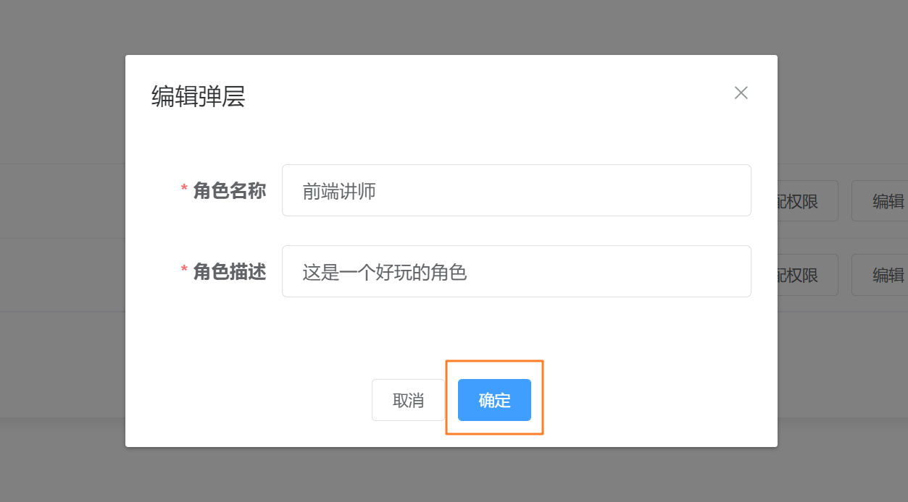
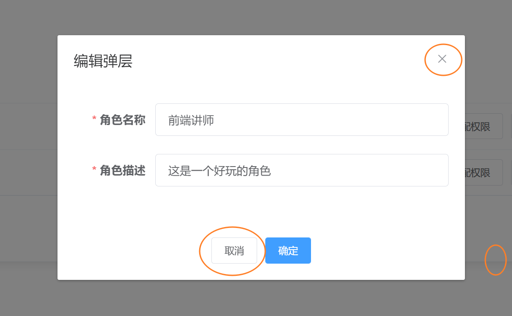

## 1. 获取角色列表并渲染

**`本节任务:`**   搭建静态页面并完成初始渲染



### 搭建静态页面

根据以上的结构，我们采用element-ui的组件实现**`src/views/setting/index.vue`**

```vue
<template>
  <div class="dashboard-container">
    <div class="app-container">
      <el-card>
        <!-- 新增角色按钮 -->
        <el-row style="height:60px">
          <el-button
            icon="el-icon-plus"
            size="small"
            type="primary"
          >新增角色</el-button>
        </el-row>
        <!-- 表格 -->
        <el-table>
          <el-table-column label="序号" width="120" />
          <el-table-column label="角色名称" width="240" />
          <el-table-column label="描述" />
          <el-table-column label="操作" width="240" fixed="right">
            <template>
                <el-button size="small">分配权限</el-button>
                <el-button size="small">编辑</el-button>
                <el-button size="small" type="danger">删除</el-button>
            </template>
          </el-table-column>
        </el-table>
        <!-- 分页组件 -->
        <el-row type="flex" justify="center" align="middle" style="height: 60px">
          <!-- 分页组件 -->
          <el-pagination layout="prev,pager,next" />
        </el-row>
      </el-card>
    </div>
  </div>
</template>
```

### 渲染角色数据

**`本节任务:`** 封装获取角色信息接口完成页面的真实数据渲染

1）封装获取角色列表接口

**`src/api/setting.js`**

```js
import request from '@/utils/request'
/**
 * @description: 获取角色列表
 * @param {*} params:{page 页码, pagesize 每页的条数}
 * @return {*}
 */
export function getRoleList(params) {
  return request({
    method:'get',
    url: '/sys/role',
    params
  })
}
```

2）业务组件调用接口

**`src/views/setting/index.vue`**

```js
import { getRoleList } from '@/api/setting'
export default {
  data() {
    return {
      roleList: [],
      params: {
          page: 1,
          pagesize: 2
      },
      total: 0
    }
  },
  mounted() {
    this.fetchRoleList() // 获取角色列表
  },
  methods: {
    async fetchRoleList() {
      const { rows,total } = await getRoleList(this.params)
      this.roleList = rows
      this.total = total
    }
  }
}
```

 3）表格绑定数据

```vue
<el-table :data="list">
  <el-table-column
    align="center"
    type="index"
    label="序号"
    width="120"
  />
  <el-table-column
    align="center"
    prop="name"
    label="名称"
    width="240"
  />
  <el-table-column align="center" prop="description" label="描述" />
  <el-table-column align="center" label="操作" width="240">
    <el-button size="small" >分配权限</el-button>
    <el-button size="small" >编辑</el-button>
    <el-button size="small" type="danger">删除</el-button>
  </el-table-column>
</el-table>
```

### 分页功能实现

**`本节任务:`** 实现列表分页的功能

> 分页的核心逻辑：总条数 / 每页条数 = 页数
>
> 分页的业务逻辑：1. 点击页码拿到当前页数 2. 把页数交给后端接口参数page 3. 拿到数据重新渲染页面

1）绑定分页数据

```vue
<!-- 分页组件 -->
<el-pagination
    layout="prev,pager,next"
    :current-page="params.page"
    :total="total"
    :page-size="params.pagesize"
    @current-change="pageChange"
/>
```

2）分页切换逻辑

```js
changePage(page) {
  // newPage是当前点击的页码
  this.params.page = page // 将当前页码赋值给当前的最新页码
  this.fetchRoleList()
}
```

## 2. 删除角色功能实现

**`本节任务:`**  实现删除角色的功能

**需求理解和思路分析**


1. 点击表格右侧`删除`按钮，询问用户是否确定删除
2. 用户点击`确定`按钮之后进行删除操作
3. 删除成功之后更新一下数据列表
4. 用户点击`取消`按钮之后关闭弹框不进行任何操作

**代码落地**

1）接口封装

```js
/**
 * @description: 删除角色
 * @param {*} id 角色id
 * @return {*}
 */
export function deleteRole(id) {
  return request({
    url: `/sys/role/${id}`,
    method: 'delete'
  })
}
```

2）删除按钮注册事件

> 这里需要注意因为我们要用到当前行的数据进行接口调用，需要采用作用域插槽进行改写模板

```vue
<!-- 作用域插槽 -->
<el-table-column align="center" label="操作" width="240">
    <template #default={ row }>
      <el-button size="small" type="success">分配权限</el-button>
      <el-button size="small" type="primary">编辑</el-button>
      <el-button size="small" type="danger" @click="fetchDelRole(row.id)">删除</el-button>
    </template>
</el-table-column>
```

3） 调用接口实现删除业务

```js
 // 删除
fetchDelRole(id) {
  this.$confirm('此操作将永久删除该角色, 是否继续?', '提示', {
    confirmButtonText: '确定',
    cancelButtonText: '取消',
    type: 'warning'
  }).then(async() => {
    // 调用删除接口
    await deleteRole(id)
    // 更新列表
    this.fetchRoleList()
    // 提示用户
    this.$message.success('删除角色成功')
  }).catch()
}
```

## 3. 新增角色功能实现

### 理解需求

**`本节任务:`** 实现新增角色功能

1. 点击新增角色展示弹框
2. 弹框中有角色名称和角色描述俩个表单项，其中角色名称和描述都为必填项
3. 点击确定按钮先进行表单验证，验证通过之后调用新增接口创建角色
4. 点击取消按钮弹框关闭，并清空表单内容及验证内容

### 实现打开关闭弹框

**`本节任务:`** 实现新增角色弹框的打开和关闭功能

```vue
<template>
    <!-- 新增角色按钮 -->
    <el-row style="height: 60px">
      <el-button
        icon="el-icon-plus"
        size="small"
        type="primary"
        @click="showRoleDialog"
      >新增角色</el-button>
    </el-row>
    <!-- 新增弹框 -->
    <el-dialog title="编辑弹层" :visible="roleDialogVisible" @close="closeRoleDialog">
      <!-- 表单内容 -->
      <!-- 底部 -->
      <el-row slot="footer" type="flex" justify="center">
          <el-button size="small">取消</el-button>
          <el-button size="small" type="primary">确定</el-button>
      </el-row>
    </el-dialog>
</template>
<script>
 export default {
    data(){
       return {
          roleDialogVisible: false
       }
    },
    methods:{
        // 打开弹框
        showRoleDialog(){
            this.roleDialogVisible = true
        },
        // 关闭弹框
        closeRoleDialog(){
            this.roleDialogVisible = false
        }
    }
 }
</script>
```

### 准备表单并校验

**`本节任务:`** 实现表单的结构搭建并完成校验



```vue
<template>
 <!-- 新增角色 -->
    <el-dialog 
         title="编辑弹层" 
         :visible="roleDialogVisible" 
         width="500px" 
         @close="closeRoleDialog"
    >
      <el-form ref="roleForm" :model="roleForm" :rules="rules" label-width="100px">
        <el-form-item label="角色名称" prop="name">
          <el-input v-model="roleForm.name" />
        </el-form-item>
        <el-form-item label="角色描述" prop="description">
          <el-input v-model="roleForm.description" />
        </el-form-item>
      </el-form>
      <!-- 底部 -->
      <el-row slot="footer" type="flex" justify="center">
        <el-button size="small">取消</el-button>
        <el-button size="small" type="primary" @click="confirmAdd">确定</el-button>
      </el-row>
    </el-dialog>
</template>
<script>
 export default {
    data(){
       return {
          roleDialogVisible: false,
          roleForm:{
               name: '',
               description: ''
          },
          rules:{
              name: [{ required: true, message: '角色名称不能为空', trigger: 'blur' }],
              description: [{ required: true, message: '角色描述不能为空', trigger: 'blur' }]
          }
       }
    },
    methods:{
       confirmAdd() {
          // 兜底校验
          this.$refs.roleForm.validate(valid => {
            if (valid) {
              // todo login
              console.log(valid)
            }
          })
        }
    }
 }
</script>
```

### 确定业务逻辑



> 确定按钮点击之后我们需要调用校验功能，接口成功调用之后我们需要完成三件事情
>
> 1. 收集表单数据，提交新增接口
> 2. 重新拉取角色列表，让新增的数据得以显示
> 3. 实现后续业务逻辑，比如提示用户本次操作已成功，关闭弹框，清空表单数据

1）封装新增接口

```js
/**
 * @description: 新增角色
 * @param {*} data {name,description}
 * @return {*}
 */
export function addRole(data) {
  return request({
    url: '/sys/role',
    data,
    method: 'post'
  })
}
```

2）点击确定调用接口

```js
confirmAdd() {
  this.$refs.roleForm.validate(async valid => {
    if (valid) {
      // todo login
      await addRole(this.roleForm)
      this.fetchRoleList()
      this.$message.success('操作成功')
      this.roleDialogVisible = false
      this.roleForm = {
         name: '',
         description: ''
      }
    }
  })
}
```

### 取消业务逻辑



> 注意这里的取消操作包括三个地方，1. 点击取消按钮 2. 点击右上角叉号 3. 点击空白区域  这三处的点击进行的逻辑都是取消逻辑，取消逻辑我们需要做的事情有三件，如下
>
> 1. 清空表单数据
> 2. 移除校验
> 3. 关闭弹框

1）封装取消函数

```js
closeRoleDialog () {
  // 清空表单数据
  this.roleForm = {
    name: '',
    description: ''
  }
  // 移除校验
  this.$refs.roleForm.resetFields()
  // 关闭弹框
  this.roleDialogVisible = false
}
```

2）模板调用

```html
<!-- 取消按钮点击 -->
<el-button size="small" @click="closeRoleDialog">取消</el-button>
```

## 4. 编辑角色功能实现

**`本节任务:`**  实现角色编辑功能

### 需求理解

1. 点击`编辑`按钮展示弹框并回显当前行的角色数据
2. 对角色名称和角色描述进行修改之后点击确定完成更新操作
3. 点击取消弹框关闭和新增时保持一致

### 数据回显实现

> 因为编辑要涉及到回显数据，所以我们需要封装俩个接口一个是获取角色详情的接口，一个是用来更新角色信息的

1）封装相关接口

```js
/**
 * @description: 获取角色详情
 * @param {*} id 角色id
 * @return {*}
 */
export function getRoleDetail(id) {
  return request({
    url: `/sys/role/${id}`
  })
}
```

2） 弹框展示回填数据

````vue
<el-button size="small" type="primary" @click="editRole(row.id)">编辑</el-button>

<script>
 export default {
     methods:{
         // 获取角色详情
        async editRole (id) {
          // 打开弹框
          this.roleDialogVisible = true
          // 调用接口获取数据 完成回显
          const res = await getRoleDetail(id)
          this.roleForm = res
        }
     }
 }
</script>
````

### 完成编辑业务

> 编辑功能除了回显之外，点击确定和取消之后的业务逻辑是一致的，确定之后我们只需要根据当前是否存在角色id，分别调用更新接口和新增接口就可以了，所以我们在btnOK方法中做下区分

封装接口函数 - `api/role.js`

```js
/**
 * @description: 编辑角色
 * @param {*} data roleForm
 * @return {*}
 */
export function updateRole(data) {
  return request({
    url: `/sys/role/${data.id}`,
    data,
    method: 'put'
  })
}
```

修改确认按钮逻辑 

```js
confirmAdd() {
  this.$refs.roleForm.validate(async valid => {
    if (valid) {
      // todo login
      if (this.roleForm.id) {
        await updateRole(this.roleForm)
      } else {
        await addRole(this.roleForm)
      }
      this.fetchRoleList()
      this.$message.success('操作成功')
      this.roleDialogVisible = false
      this.roleForm = {
        name: '',
        description: ''
      }
    }
  })
}
```

### 区分弹框标题显示

> 根据当前是否存在角色id来决定应该显示什么，有id证明在编辑，没有id证明是新增

```html
<el-dialog 
   :title="roleForm.id?'编辑角色':'新增角色'" 
  >
</el-dialog>
```


