## 1. 封装通用工具栏组件

**`本节任务`**封装一个通用的工具栏供多个业务组件使用

> 在后续的业务开发中，经常会用到一个类似下图的工具栏，作为公共组件，进行一下封装，方便复用


### 搭建静态UI结构

我们有一个专门的components目录用来放置业务通用组件，在里面新建一个PageTools组件

`src/components/PageTools/index.vue`

```vue
<template>
  <el-card>
    <div class="page-tools">
      <!-- 左侧 -->
      <div class="left">
        <div class="tips">
          <i class="el-icon-info" />
          <span>本月: 社保在缴 公积金在缴</span>
	    </div>
      </div>
      <div class="right">
        <!-- 右侧 -->
        <el-button type="primary" size="small">历史归档</el-button>
        <el-button type="primary" size="small">导出</el-button>
      </div>
    </div>
  </el-card>
</template>

<script>
export default {}
</script>

<style lang="scss" scoped>
.page-tools {
  display: flex;
  justify-content: space-between;
  align-items: center;
  ::v-deep.tips {
    line-height: 34px;
    padding: 0px 15px;
    border-radius: 5px;
    border: 1px solid rgba(145, 213, 255, 1);
    background: rgba(230, 247, 255, 1);
    i {
      margin-right: 10px;
      color: #409eff;
    }
  }
}
</style>
```

### 插槽优化和测试

> 组件的左边内容和右边内容可能会根据使用者的不同显示不同的内容，是不能写死的，我们可以通过具名插槽来做一下内容自定义优化

```vue
<template>
  <el-card>
    <div class="page-tools">
      <!-- 左侧 -->
      <div class="left">
        <div class="tips">
          <slot name="left" />
        </div>
      </div>
      <!-- 右侧 -->
      <div class="right">
        <slot name="right" />
      </div>
    </div>
  </el-card>
</template>
```

上面我们使用了俩个具名插槽，将来在使用组件的时候，只需要按照对应的插槽名称就可以在特定的位置插入内容

### 业务组件使用

> 我们在员工管理的业务组件内部直接通过使用全局组件的方式将page-tools使用起来，并注入自定义内容

`src/views/employees/index.vue`

```html
<template>
  <div class="employees-container">
    <div class="app-container">
      <page-tools>
        <!-- 插入到left插槽位置 -->
        <template #left>
          <i class="el-icon-info" />
          <span>本月: 社保在缴 公积金在缴</span>
        </template>
         <!-- 插入到right插槽位置 -->
        <template #right>
          <el-button type="primary" size="small">导入excel</el-button>
          <el-button type="primary" size="small">导出excel</el-button>
          <el-button type="primary" size="small">新增员工</el-button>
        </template>
      </page-tools>
    </div>
  </div>
</template>
<script>
  import PageTools from '@/components/PageTools'
  export default {
      components:{
         PageTools
      }
  }
</script>
```

### 注册全局组件

> 我们的业务组件一般都定义成了局部组件，使用的时候需要在components中注册，而我们全局通用组件一般是需要定义为全局组件的，不需要局部注册

`main.js`

```js
import PageTools from '@/components/PageTools'
Vue.component('PageTools', PageTools)
```

以上我们通过Vue.component全局API实现了全局注册，在业务组件中就不需要再引入和注册了，直接使用即可

### 插件方式优化

> 上面的方式虽然可以非常方便的完成注册，但是大家想象一个场景，如果我们需要注册的全局组件非常多，我们需要一个一个引入，然后分别调用Vue.component方法，main.js文件会变的很大，不好维护，为了解决这个问题，我们给它优化成插件的形式
>
> https://cn.vuejs.org/v2/guide/plugins.html

1）插件开发 - components/index.js

```javascript
import PageTools from './PageTools'
const componentPlugin = {
    install(Vue){
        Vue.component('PageTools',PageTools)
    }
}
export default componentPlugin
```

2）插件注册 - main.js

```js
import componentPlugin from '@/components'
Vue.use(componentPlugin)
```

## 2. 员工列表渲染

**`本节任务:`** 实现员工列表的结构搭建和数据渲染

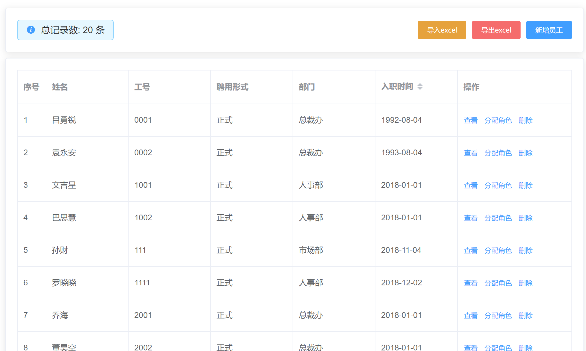

### 页面结构搭建

 **`src/employees/index.vue`**

```vue
<template>
  <div class="employees-container">
    <div class="app-container">
      <page-tools>
        <template #left>
          <i class="el-icon-info" />
          <span>总记录数: 200</span>
        </template>
        <template #right>
          <el-button type="warning" size="small">excel导入</el-button>
          <el-button type="danger" size="small">excel导出</el-button>
          <el-button type="primary" size="small">新增员工</el-button>
        </template>
      </page-tools>

      <el-card style="margin-top: 10px;">
        <el-table border>
          <el-table-column label="序号"/>
          <el-table-column label="姓名"/>
          <el-table-column label="工号"/>
          <el-table-column label="聘用形式"/>
          <el-table-column label="部门"/>
          <el-table-column label="入职时间" width="180"/>
          <el-table-column label="操作"  fixed="right" width="200">
            <template>
              <el-button type="text" size="small">查看</el-button>
              <el-button type="text" size="small">分配角色</el-button>
              <el-button type="text" size="small">删除</el-button>
            </template>
          </el-table-column>
        </el-table>
      </el-card>
    </div>
  </div>
</template>
```

### 渲染表格数据

1）封装获取列表api函数 **`src/api/employees.js`**

```js
import request from '@/utils/request'

/**
 * @description: 获取员工列表
 * @param {*} params {page:当前页,size: 每页条数}
 * @return {*}
 */
export function getEmployeeList(params) {
  return request({
    methods: 'get',
    url: '/sys/user',
    params
  })
}
```

2） 准备数据调用接口 - **`src/employees/index.vue`**

```html
<script>
import { getEmployeeList } from '@/api/employees'
export default {
  name: 'Employees',
  data() {
    return {
      list: [],
      params:{
        page: 1, // 当前页
      	size: 10, // 每页条数 
      },
      total: 0, // 总数
    }
  },
  mounted() {
    this.getEmployeeList()
  },
  methods: {
    async fetchList() {
      const { rows, total } = await getEmployeeList(this.params)
      this.list = rows
      this.total = total
    }
  }
}
</script>
```

3） 渲染表格

```html
<el-table-column width="60" label="序号" type="index" />
<el-table-column label="姓名" prop="username" />
<el-table-column label="工号" prop="workNumber" />
<el-table-column label="聘用形式" prop="formOfEmployment" />
<el-table-column label="部门" prop="departmentName" />
<el-table-column label="入职时间" prop="timeOfEntry" />
```

## 3. 表格数据格式化

**`本节任务:`**  对后端直接给到的数据做一些格式化处理，包括聘用形式

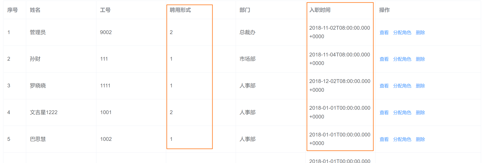

### 聘用形式格式化

```jsx
<template #default="{row }">
  {{ formatEmployment(row.formOfEmployment) }}
</template>
  
// 格式化聘用形式函数
formatEmployment(type) {
  const map = {
    1: '正式',
    2: '非正式'
  }
  return map[type]
}
```

### 入职时间格式化

> 针对于时间我们使用dayjs插件处理

1）安装dayjs

```bash
yarn add dayjs
```

2）封装处理方法

```js
methods: {
    formatDate(value, str = 'YYYY-MM-DD') {
      return dayjs(value).format(str)
    }
}
```

3）模板使用方法

```html
<el-table-column label="入职时间">
    <template #default="{ row }">
      {{ formatDate(row.timeOfEntry)}}
    </template>
</el-table-column>
```

## 4. 分页逻辑处理（练习）

**`本节任务:`**   实现分页获取数据逻辑

```jsx
<!-- 分页组件 -->
<div style="height: 60px; margin-top: 10px">
  <el-pagination
    :total="total"
    :current-page="params.page"
    :page-size="params.size"
    layout="prev, pager, next"
    @current-change="pageChange"
  />
</div>

// 分页切换
pageChange(page) {
  this.params.page = page
  this.fetchList()
}
```

## 5. 删除员工功能（练习）

**`本节任务:`**  实现删除员工的功能

1）封装删除接口

```js
/**
 * @description: 删除员工
 * @param {*} id 员工id
 * @return {*}
 */
export function delEmployee(id) {
  return request({
    method: 'delete',
    url: `/sys/user/${id}`
  })
}
```

2）调用接口实现删除

```jsx
<el-table-column label="操作" fixed="right" width="280">
    <template #default="{ row }">
      <el-button type="text" size="small">查看</el-button>
      <el-button type="text" size="small">分配角色</el-button>
      <el-button type="text" size="small" @click="fetchDelEmploy(row.id)">删除</el-button>
    </template>
</el-table-column>

async fetchDelEmploy(id) {
  this.$confirm('你确认要删除么?', '温馨提示').then(async() => {
    await delEmployee(id)
    this.fetchList()
    this.$message.success('删除员工成功')
  }).catch(error => {
    console.log(error)
  })
}
```

## 6. 新增员工功能实现

**`本节任务:`**  实现新增员工的功能

### 理解需求

```
1. 点击新增按钮 弹框展示  
2. 把弹框的部分抽离成一个子组件 父传子 visible 控制它的显示和隐藏
3. 在子组件中写表单 调用接口 子传父  更新列表
```

### 实现弹框打开关闭

```vue
<!-- 新增员工按钮 -->
<el-button type="primary" size="small" @click="addEmploy">新增员工</el-button>

<!-- 新增弹框 -->
<el-dialog title="新增员工" :visible="visible" @close="closeDialog" />

<script>
export default {
    data(){
        return {
            visible: false
        }
    },
    methods:{
        // 添加
        addEmploy() {
          this.visible = true
        },
        // 关闭弹框
        closeDialog() {
          this.visible = false
        }
    }
}
</script>
```

### 封装弹框组件

1）新增一个子组件 - `./components/add-employee.vue`

```vue
<template>
  <el-dialog title="新增员工" :visible="visible" @close="closeDialog">
    <!-- 表单 -->
    <!-- footer插槽 -->
    <template #footer>
      <el-button>取消</el-button>
      <el-button type="primary">确定</el-button>
    </template>
  </el-dialog>
</template>

<script>
export default {
  props: {
    visible: {
      type: Boolean,
      default: false
    }
  },
  methods:{
      closeDialog(){
          this.$emit('close-dialog')
      }
  }
}
</script>
```

2）引入使用弹框组件

```vue
<add-employee :visible="visible" @close-dialog="closeDialog" />

<script>
import AddEmployee from './components/add-employee.vue'
export default {
  components: {
    AddEmployee
  }
}
</script>
```


```html
<template>
  <el-dialog title="新增员工" :visible="visible">
    <!-- 表单 -->
    <el-form label-width="120px">
      <el-form-item label="姓名">
        <el-input style="width:50%" placeholder="请输入姓名" />
      </el-form-item>
      <el-form-item label="手机">
        <el-input style="width:50%" placeholder="请输入手机号" />
      </el-form-item>
      <el-form-item label="入职时间">
        <el-date-picker style="width:50%" placeholder="请选择入职时间" />
      </el-form-item>
      <el-form-item label="聘用形式">
        <el-select style="width:50%" placeholder="请选择" />
      </el-form-item>
      <el-form-item label="工号">
        <el-input style="width:50%" placeholder="请输入工号" />
      </el-form-item>
      <el-form-item label="部门">
        <el-input style="width:50%" placeholder="请选择部门" />
      </el-form-item>
      <el-form-item label="转正时间">
        <el-date-picker style="width:50%" placeholder="请选择转正时间" />
      </el-form-item>
    </el-form>
    <!-- footer插槽 -->
    <template v-slot:footer>
      <el-button>取消</el-button>
      <el-button type="primary">确定</el-button>
    </template>
  </el-dialog>
</template>

<script>
export default {
  props: {
    showDialog: {
      type: Boolean,
      default: false
    }
  }
}
</script>
```

### 准备表单并验证

1）准备表单数据和规则对象

```jsx
data() {
  return {
    formData: {
      username: '', // 用户名
      mobile: '', // 手机号
      formOfEmployment: '', // 聘用形式
      workNumber: '', // 工号
      departmentName: '', // 部门
      timeOfEntry: '', // 入职时间
      correctionTime: '' // 转正时间
    },
    rules: {
      username: [
        { required: true, message: '用户姓名不能为空', trigger: ['blur', 'change'] },
        { min: 1, max: 4, message: '用户姓名为1-4位', trigger: ['blur', 'change'] }
      ],
      mobile: [
        { required: true, message: '手机号不能为空', trigger: ['blur', 'change'] },
        { pattern: /^1[3-9]\d{9}$/, message: '手机号格式不正确', trigger: ['blur', 'change'] }
      ],
      formOfEmployment: [
        { required: true, message: '聘用形式不能为空', trigger: ['blur', 'change'] }
      ],
      workNumber: [
        { required: true, message: '工号不能为空', trigger: ['blur', 'change'] }
      ],
      departmentName: [
        { required: true, message: '部门不能为空', trigger: ['blur', 'change'] }
      ],
      timeOfEntry: [
        { required: true, message: '请选择入职时间', trigger: ['blur', 'change'] }
      ]
    }
  }
}
```

2）绑定表单对象和规则对象

```jsx
<el-form ref="addForm" :model="formData" :rules="rules" label-width="120px">
  <el-form-item label="姓名" prop="username">
    <el-input v-model="formData.username" style="width:50%" placeholder="请输入姓名" />
  </el-form-item>
  <el-form-item label="手机" prop="mobile">
    <el-input v-model="formData.mobile" style="width:50%" placeholder="请输入手机号" />
  </el-form-item>
  <el-form-item label="入职时间" prop="timeOfEntry">
    <el-date-picker v-model="formData.timeOfEntry" style="width:50%" placeholder="请选择入职时间" />
  </el-form-item>
  <el-form-item label="聘用形式" prop="formOfEmployment">
    <el-select v-model="formData.formOfEmployment" style="width:50%" placeholder="请选择" />
  </el-form-item>
  <el-form-item label="工号" prop="workNumber">
    <el-input v-model="formData.workNumber" style="width:50%" placeholder="请输入工号" />
  </el-form-item>
  <el-form-item label="部门" prop="departmentName">
    <el-input v-model="formData.departmentName" style="width:50%" placeholder="请选择部门" />
  </el-form-item>
  <el-form-item label="转正时间" prop="correctionTime">
    <el-date-picker v-model="formData.correctionTime" style="width:50%" placeholder="请选择转正时间" />
  </el-form-item>
</el-form>
```

### 聘用形式渲染

> 聘用形式的数据直接从常量中获取即可，EmployeeEnum.hireType表示聘用形式数组对象

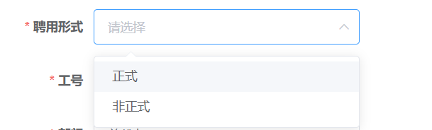

1）准备常量数据

> 把项目资源/枚举中的 `contanst` 文件夹复制到项目的  `api` 目录下

2）渲染常量数据

```vue
<el-form-item label="聘用形式" prop="formOfEmployment">
  <el-select v-model="formData.formOfEmployment" style="width:50%" placeholder="请选择">
    <el-option 
        v-for="item in hireList" 
        :key="item.id" 
        :label="item.value" 
        :value="item.id" 
    />
  </el-select>
</el-form-item>

<script>
import TYPE from '@/api/constant/employees'
export default {
    data(){
        return {
           hireList: TYPE.hireType 
        }
    }
}
</script>
```

### 部门数据渲染

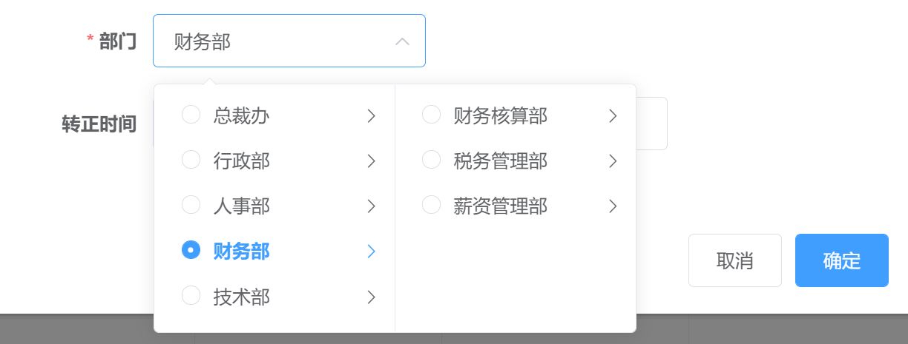

> 获取部门数据的时机我们选择弹框打开的事件中，避免浪费，只有弹框打开才获取数据

```vue
<template>
    <el-dialog title="新增员工"  @open="openDialog">
      <el-form-item label="部门" prop="departmentName">
       <el-cascader 
           v-model="formData.departmentName"
           :props="departProps" 
           :options="departList" 
           :show-all-levels="false" 
        />
      </el-form-item>
    </el-dialog>
</template>

<script>
import { getDepartments } from '@/api/department'
import { transTree } from '@/utils/translateTree'
export default {
  data() {
    return {
      departProps: {
        label: 'name',
        value: 'name',
        checkStrictly: true
      },
      departList: [] // 部分列表
    }
  },
  methods: {
    async openDialog() {
      const res = await getDepartments()
      this.departList = transTree(res.depts)
    }
  }
}
</script>
```

### 完成新增功能

> 注意提交表单时的数据处理，departmentName字段

1）封装新增员工api - **`src/api/employees.js`**

```js
/**
 * @description: 添加员工
 * @param {*} data
 * @return {*}
 */
export function addEmployee(data) {
  return request({
    method: 'post',
    url: '/sys/user',
    data
  })
}
```

2）注册点击事件

````jsx
<el-button type="primary" @click="submitAdd">确定</el-button>
````

```jsx
submitAdd() {
  this.$refs.addForm.validate(async valid => {
    if (!valid) return
    await addEmployee({
      ...this.formData,
      departmentName: this.formData.departmentName[this.formData.departmentName.length - 1]         }) // 调用新增接口
    this.$message.success('添加成功')
    this.cloaseDialog()
  })
}
```

3）重置表单数据

```jsx
closeDialog() {
  this.$emit('close-dialog')
  // 重置原来的数据
  this.formData = {
    username: '',
    mobile: '',
    formOfEmployment: '',
    workNumber: '',
    departmentName: '',
    timeOfEntry: '',
    correctionTime: ''
  }
  // 重置校验结果
  this.$refs.addForm.resetFields() 
}
```

## 7. 员工导入功能

### 功能描述和流程分析

**`本节任务:`**  了解批量导入的业务需求和导入的大致流程

> 刚才我们完成的员工添加是一个一个进行的，实际情况中有时候需要我们一次性添加多个员工信息，这个时候就需要我们开发一个批量导入的功能，点击`excel导入`按钮，选择准备好要导入的excel表格文件，进行批量添加

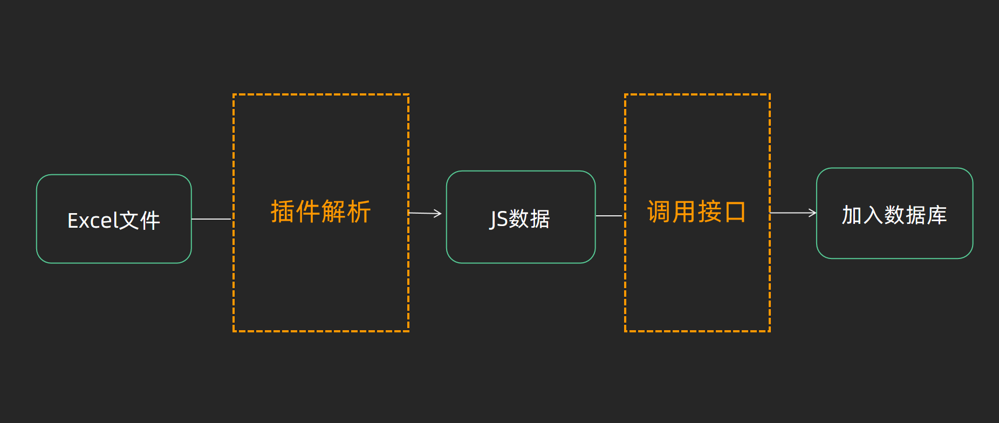


### 新增导入路由

**`本节任务:`**  新增一个专门用来做导入功能的路由组件


1）准备导入组件

`views/ImportExcel/index.vue`

```vue
<template>
  <div class="excel-container">
    excel导入
  </div>

</template>

<script>
export default {
  name: 'ImportExcel'
}
</script>

<style lang="scss" scoped>
.excel-container{
  padding:50px;
}
</style>

```

2）绑定组件到路由

```js
{
    path: '/import',
    component: Layout,
    hidden: true,
    children: [{
      path: '',
      name: 'importExcel',
      component: () => import('@/views/ImportExcel'),
      meta: { title: 'excel导入' }
    }]
}
```

### 寻找现成解决方案

**`本节任务:`** 按照实际开发找到现成的可以直接用的解决方案

1. vue-element-admin  

   项目地址  https://gitee.com/panjiachen/vue-element-admin

   预览地址  https://panjiachen.gitee.io/vue-element-admin/#/excel/upload-excel

2. 点击左侧功能菜单切换到对应功能位置

   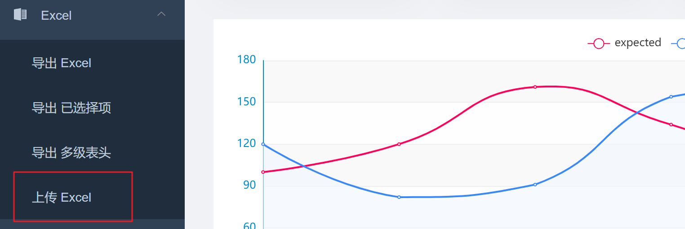

3. 根据路由地址path找到对应的业务组件位置

   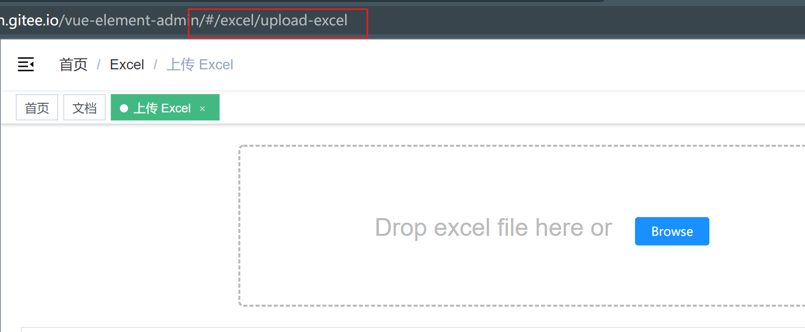

4. 复制业务组件所有代码到自己项目的业务组件

   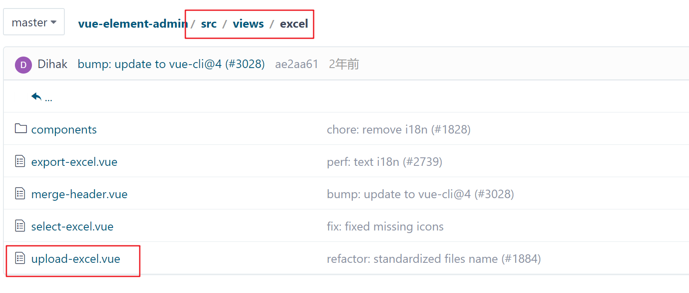

5. 找到核心插件的组件位置复制到自己项目的通用组件位置

   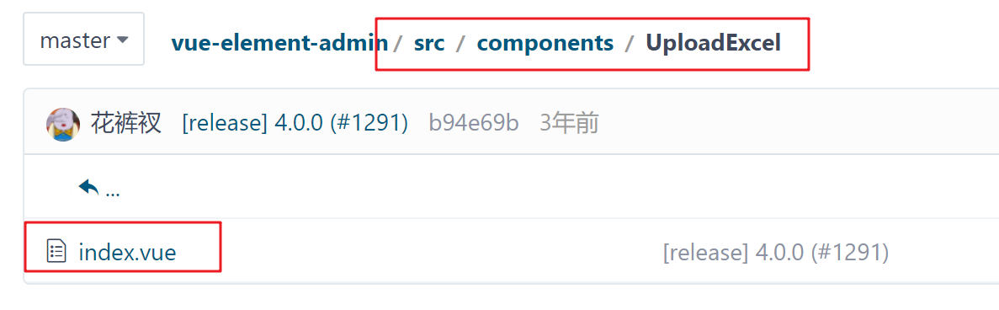

   

### 熟悉Excel导入组件

**`本节任务:`** 熟悉现成的Excel导入组件

`components/UploadExcel/index.vue`

```html
<script>
import * as XLSX from 'xlsx'

export default {
  props: {
    beforeUpload: Function, // eslint-disable-line
    onSuccess: Function// eslint-disable-line
  }
}
</script>
```

组件提供了俩个props，可以由使用者来传入，一个为解析Excel成功之后调用的函数，一个为上传之前的校验函数

注：上传一下准备好的excel表格，查看一下函数onSuccess传入的参数

组件依赖一个必要的插件包，叫做  `xlsx`，这个插件的作用就是  `把excel文件解析成js数据`

`views/ImportExcel/index.vue`

```vue
<template>
  <div class="excel-container">
    <upload-excel
      :before-upload="beforeUpload"
      :on-success="onSuccess"
    />
  </div>
</template>

<script>
export default {
  name: 'ImportExcel',
  methods: {
    beforeUpload(file) {
      console.log('上传前', file)
      return true
    },
    onSuccess({ results, header }) {
      console.log('上传完成', results, header)
    }
  }
}
</script>
```

经过测试，我们可以打印出来必要的参数，可以根据实际需求做解析前的校验动作和解析之后的后续处理

### Excel文件校验

**`本节任务:`**  实现对Excel文件的大小和类型校验

### 调用接口完成批量创建

**`本节任务:`** 将excel解析好的数据经过正确的处理调用接口完成批量添加 （数据转换方法已经提供）

> 调用接口进行excel的重点其实是数据的处理，我们需要按照接口的要求，把excel表格中经过插件处理好的数据处理成后端接口要求的格式，主要包括俩方面
>
> 1. 接口字段的key需要从中文转成英文
> 2. 涉及到时间的字段需要进行严格的时间格式化处理
> 3. 手机号要求不能出现重复
>

**实现步骤**

1. 封装接口重点关注接口要求的传参格式
2. 按照接口要求的格式处理excel插件解析之后的数据
3. 调用导入接口完成员工导入

**代码落地**

1）封装api接口

```js
/**
 * @description: 导入excel
 * @param {*} data 
    [{
      	 mobile: 15751786320
      	 timeOfEntry: "2019-03-09T16:00:00.000Z"
     	 username: "测试人员1"
     	 workNumber: 88088,
     	 formOfEmployment: 0,
     	 departmentName: "技术部"
      }
    ]
 * @return {*}
 */
export function importEmployee(data) {
  return request({
    url: '/sys/user/batch',
    method: 'post',
    data
  })
}
```

2）数据转换并调用接口

```js
import { importEmployee } from '@/api/employees'
import { getImportJsData } from '@/utils/excelData'
export default {
  name: 'ImportExcel',
  methods: {
    async handleSuccess({ results, header }) {
      // 1.拿到数据 通过格式化方法 处理成后端要求的数据格式
      // 2.调用真实接口传递数据
      const headerRelation = {
        '姓名': 'username',
        '手机号': 'mobile',
        '入职日期': 'timeOfEntry',
        '工号': 'workNumber',
        '聘用形式': 'formOfEmployment',
        '部门': 'departmentName'
      }
      const formatData = getImportJsData(results, headerRelation)
      await importEmployee(formatData)
    }
  }
}
```

重点注意，**`导入的手机号不能和之前的存在的手机号重复`**

### 方案总结

前端主导方案（数据量偏少 Excel的解析放在浏览器中）

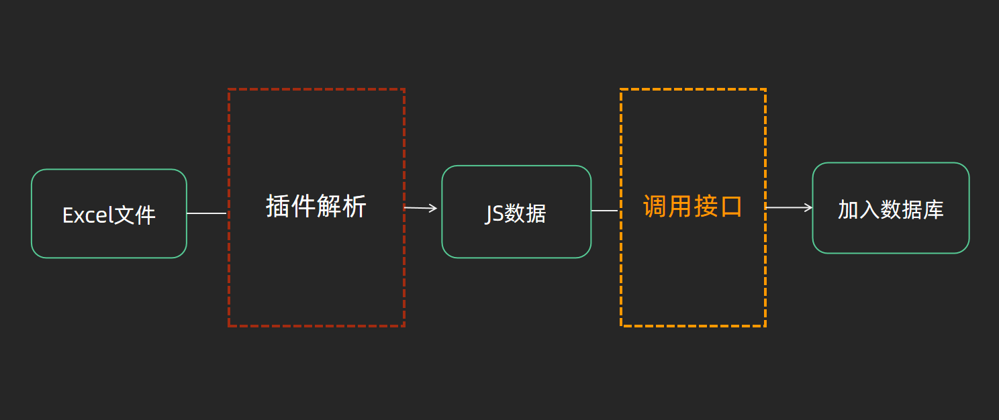

**后端主导方案（数据量偏大，Excel的解析放在服务器做）**

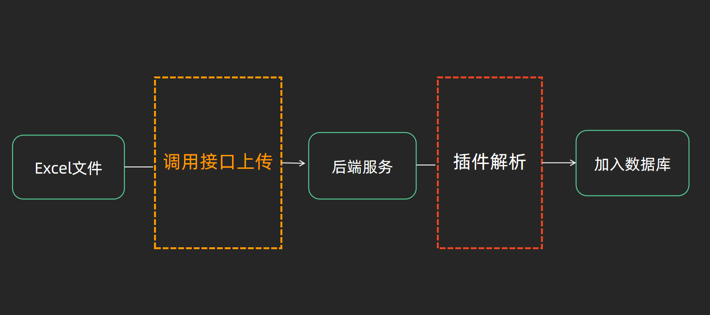


## 8. 员工导出功能

### 功能描述和流程分析

> 需求描述：点击`excel导出`按钮，把table当前页的数据导出为excel表格
>
> 前置工作：这个功能在我们课程一开始学习的vue-element-admin中有现成的功能参考，我们也在`项目资源`里提供了现成的插件包，大家先把它复制到自己项目的`src目录`下

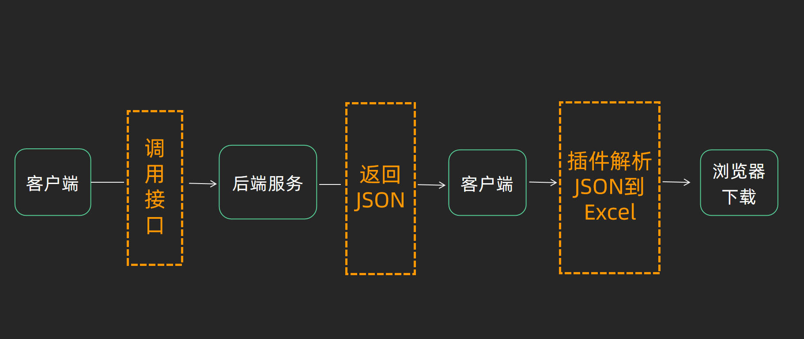


### 熟悉Excel导出组件

**`本节任务:`**   熟悉一下Excel导出组件的各种API和基础使用方法

1）API熟悉

```js
import('@/vendor/Export2Excel').then(excel => {
  // excel表示导入的模块对象
  excel.export_json_to_excel({
    header: [], // 表头header 必填 要求是一个数组
    data: [
      [],
      []
    ], // 表格数据body 要求是一个二维数组
    filename: 'excel-list', // 文件名称
    autoWidth: true, // 宽度是否自适应
    bookType: 'xlsx' // 生成的文件类型
  })
})
```

| 参数      | 说明                   | 类型    | 可选值                                                       | 默认值     |
| --------- | ---------------------- | ------- | ------------------------------------------------------------ | ---------- |
| header    | 导出数据的表头         | Array   | /                                                            | []         |
| data      | 导出的具体数据         | Array   | /                                                            | **[[]]**   |
| filename  | 导出文件名             | String  | /                                                            | excel-list |
| autoWidth | 单元格是否要自适应宽度 | Boolean | true / false                                                 | true       |
| bookType  | 导出文件类型           | String  | xlsx, csv, txt, [more](https://github.com/SheetJS/js-xlsx#supported-output-formats) | xlsx       |

2）安装必要依赖

```bash
yarn add file-saver script-loader
```

3）为什么使用import语法？

导出功能是一个不一定会用到的功能，而且依赖的插件包体积比较大，为了减少包体积大小，应该采用动态导入的语法，也就是按需导入，这里的import语法代表只有点击导出按钮时才会动态引入相关js文件


### 基础导出功能实现

**`本节任务:`**   先不用接口数据，使用静态数据做一个基础的导出功能

```js
import('@/vendor/Export2Excel').then(excel => {
  // excel表示导入的模块对象
  excel.export_json_to_excel({
    header: ['姓名', '工资'], // 表头 必填
    data: [
      ['刘备', 100],
      ['关羽', 500]
    ], // 具体数据 必填
    filename: 'excel-list', // 文件名称
    autoWidth: true, // 宽度是否自适应
    bookType: 'xlsx' // 生成的文件类型
  })
})
```

以上代码表示

1. 当我们正式点击`导出`按钮之后，才去加载vendor文件夹中的Export2Excel模块
2. import方法执行完毕返回的是一个promise对象，在then方法中我们可以拿到使用的模块对象
3. 重点关注data的配置部分，我们发现它需要一个严格的二维数组  |


### 业务导出功能实现

**`本节任务:`**使用业务真实数据实现导出功能

> 要实现业务导出功能主要有以下关键点
>
> 1. 准备好业务中excel导出需要的表头数据header
>
> 2. 准备好业务中excel导出需要的表格数据data（**二维数组**）

**实现步骤**

1. 准备表头中英文对应关系对象
2. 调用后端接口获取当前的最新员工列表数据
3. 按照提供的处理方法传入参数得到header数据和table数据（工具函数已经备好）
4. 调用excel导出方法并且把header数据和table数据填入

**代码落地**

```js
exportEmployee() {
 import('@/vendor/Export2Excel').then(async excel => {
    // excel表示导入的模块对象
    const res = await getEmployeeList(this.params)
    const headerRelation = {
      '姓名': 'username',
      '手机号': 'mobile',
      '入职日期': 'timeOfEntry',
      '工号': 'workNumber',
      '聘用形式': 'formOfEmployment',
      '部门': 'departmentName'
    }
    const { data } = getExportData(res.rows, headerRelation)
    excel.export_json_to_excel({
      header: Object.keys(headerRelation), // 表头 必填
      data: data, // 具体数据 必填
      filename: 'excel-list', // 文件名称
      autoWidth: true, // 宽度是否自适应
      bookType: 'xlsx' // 生成的文件类型
    })
  })
}
```

### 方案总结

前端主导方案（数据量偏少 Excel的解析放在浏览器中）

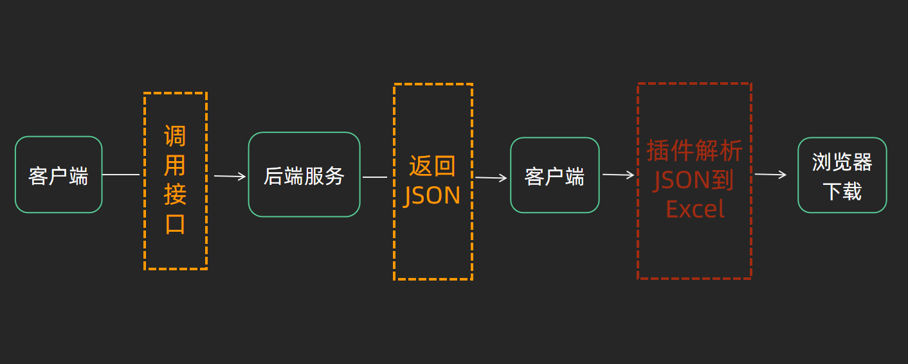

**后端主导 （数据处理成excel发生在服务器  数据量非常大 ）**

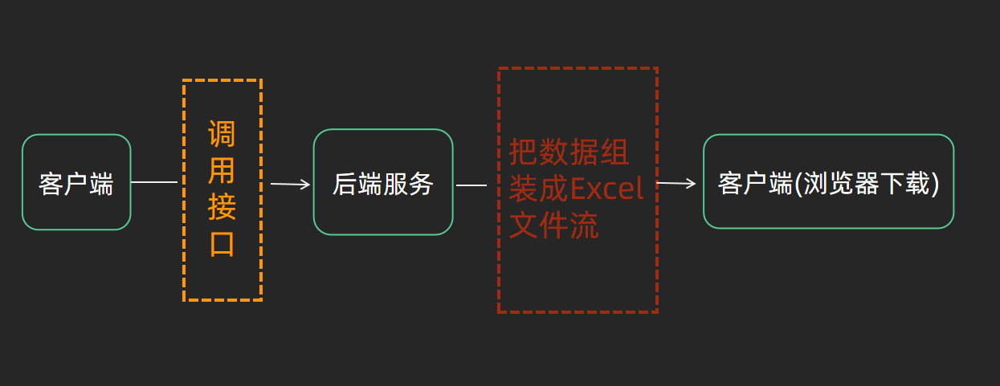
