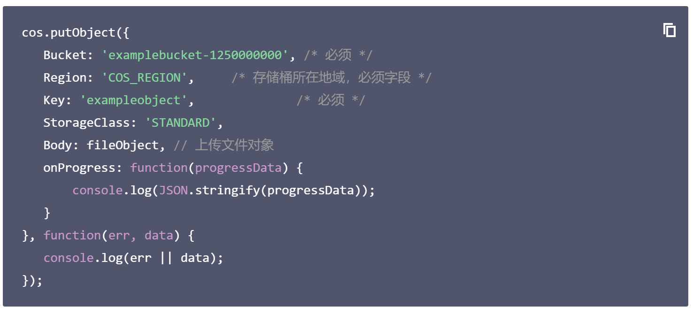

## 1. 页面布局与路由绑定

**`本节目标:`** 创建员工详情的主要布局页面和基本布局

1）搭建页面结构


`views/employees/detail.vue`

```html
<template>
  <div class="employees-container">
    <div class="app-container">
      <el-card>
        <!-- 放置表单 -->
        <el-form ref="userForm" label-width="120px" :model="userInfo" :rules="rules" style="margin-left: 120px; margin-top:30px">
          <el-form-item label="姓名:" prop="username">
            <el-input v-model="userInfo.username" style="width:300px" />
          </el-form-item>

          <el-form-item label="手机">
            <el-input v-model="userInfo.mobile" disabled style="width:300px" />
          </el-form-item>

          <el-form-item label="入职时间">
            <el-date-picker
              v-model="userInfo.timeOfEntry"
              type="date"
              value-format="yyyy-MM-dd"
            />
          </el-form-item>

          <el-form-item label="员工头像">
            <upload-img v-model="userInfo.staffPhoto" />
          </el-form-item>

          <!-- 保存个人信息 -->
          <el-row class="inline-info" type="flex" justify="center">
            <el-col :span="12">
              <el-button type="primary" @click="confirm">保存更新</el-button>
              <el-button @click="$router.back()">返回</el-button>
            </el-col>
          </el-row>
        </el-form>
      </el-card>
    </div>
  </div>
</template>
```

2） 组件绑定路由

> 员工详情页属于员工模块，所以直接和列表路由写到一起

`router/modules/employees.js`

```js
{
    path: 'detail',
    component: () => import('@/views/employees/detail'),
    hidden: true, // 不在左侧菜单显示
    meta: {
      title: '员工详情'
    }
 }
```

3） 列表跳转详情

> 详情页必定要展示数据，我们把必要的id参数通过路由传参传递过去

```vue
<template>
    <el-button 
         type="text" 
         size="small" 
         @click="goDetail">
        查看
    </el-button>
</template>
<script>
 export default {
     methods:{
        goDetail(id) {
          this.$router.push({
            path: '/employees/detail',
            query: {
              id
            }
          })
        }
    }
 }
</script>
```

通过以上操作，我们完成页面跳转，并且携带了必要的id参数

## 2. 回显数据更新用户名

**`本节目标:`** 完成数据回填并对姓名的修改更新

### 回显数据

1） 封装请求api

 该接口已经在之前提供过了 **`src/api/user.js`**

```js
/**
 * @description: 获取用某个用户的信息
 * @param {*} id
 * @return {*}
 */
export function getUserDetailById(id) {
  return request({
    url: `/sys/user/${id}`
  })
}
```

2） 实现回显逻辑

```html
<script>
import { getUserDetailById } from '@/api/user'
export default {
  data() {
    return {
      userInfo: {}
    }
  },
  mounted() {
    this.hGetUserInfoById()
  },
  methods: {
    async hGetUserInfoById() {
      const data = await getUserDetailById(this.$route.query.id)
      this.userInfo  = data
    }
  }
}
</script>
```

### 给姓名添加验证

```html
<el-form
    ref="userForm"
    :rules="rules"
    :model="userInfo"
    label-width="120px"
    style="margin-left: 120px; margin-top: 30px"
  >
    <el-form-item label="姓名:" prop="username">
      <el-input v-model="userInfo.username" style="width: 300px" />
    </el-form-item>
 </el-form>
<script>
export default {
  data() {
    return {
      userId: this.$route.query.id,
      userInfo: {},
      rules: {
        userName: [
          { required: true, message: '姓名不能为空', trigger: 'blur' }
        ]
      }
    }
  },
  mounted() {
    this.hGetUserInfoById()
  }
}
</script>
```

### 修改用户名

1）封装修改信息api

 **`src/api/employees.js`**

```js
/**
 * @description: 保存员工信息
 * @param {*} data
 * @return {*}
 */
export function saveUserDetailById(data) {
  return request({
    url: `/sys/user/${data.id}`,
    method: 'put',
    data
  })
}
```

2）修改用户名  

**`src/views/employees/detail.vue`**

```html
<script>
import { getUserDetailById } from '@/api/user'
import { saveUserDetailById } from '@/api/employees'
export default {
  data() {
    return {
      userInfo: {},
      rules: {
        userName: [
          { required: true, message: '姓名不能为空', trigger: 'blur' }
        ]
      }
    }
  },
  mounted() {
    this.hGetUserInfoById()
  },
  methods: {
    async hGetUserInfoById() {
      const data = await getUserDetailById(this.userId)
      this.userInfo = data
    },
    // 重点在这里哦
    hSaveUserDetailById() {
      this.$refs.userForm.validate(async valid => {
        // 使用最新修改数据覆盖源数据 作为接口提交数据
        await saveUserDetailById(this.userInfo)
        this.$message.success('更新成功')
      })
    }
  }
}
</script>
```


## 3. 图片上传存储方案

**`本节目标:`** 了解主流的图片存储方案和上传流程

### 方案说明

| 方案                     | 场景                                                         | 是否主流 |
| ------------------------ | ------------------------------------------------------------ | -------- |
| 存放到自己公司普通服务器 | 即少量的图片的简单场景                                       | 否       |
| 存放到三方云服务器       | 大量的图片视频等，且需要额外的功能，比如水印处理，视频审核等（专业的人做专业的事儿） 七牛云/腾讯云/阿里云 | 是       |


### 流程说明


## 4. 腾讯云cos申请配置

**`本节目标:`** 使用现成的腾讯云服务创建一个免费的云存储

### 1. 创建账号实名认证


### 2. 创建存储桶


### 4. 设置cors规则

> 因为我们是在测试上传，全部容许上传即可，真正的生产环境需要单独配置具体的域名和操作方法


### 5. 秘钥配置说明

> 服务器属于个人的，需要一定的权限才能自由上传图片，这个负责权限验证的其实就是秘钥，也就是说拥有秘钥是进行上传的必要条件

**秘钥配置**


**安全性提示**

实际工作中，秘钥属于敏感信息，不能直接放到前端存储，容易产生安全问题，更好的做法是把秘钥交给后端管理，前端通过调用接口先获取秘钥，有了秘钥之后再进行上传操作

以上我们就完成了，所有的准备工作~

## 5. 上传组件 - 基础封装

**`本节目标:`** 封装一个通用的上传组件供业务组件使用

### 理解需求并新建上传组件

**理解需求**

> 前端主动发起图片上传使用的是三方的腾讯云上传接口，前端得到一个已经上传完毕的图片地址，然后把这个地址当成一个接口字段 传给我们自己的后端服务


**新建公共上传组件**

> 我们的上传功能是基于element上传组件的二次开发，先准备好我们需要的elementUI上传组件，根据我们具体的业务需求选取一个合适的样例代码

`src/components/UploadImg`

```html
<template>
  <div>
    <el-upload
      class="avatar-uploader"
      action="#"
      :show-file-list="false"
      :on-success="handleAvatarSuccess"
      :before-upload="beforeAvatarUpload"
      :http-request="upload"
    >
      
      <i v-else class="el-icon-plus avatar-uploader-icon" />
    </el-upload>
  </div>
</template>

<script>
export default {
  data() {
    return {
      imageUrl: ''
    }
  },
  methods: {
    upload(file) {
      console.log(file)
    },
    handleAvatarSuccess(res, file) {
      this.imageUrl = URL.createObjectURL(file.raw)
    },
    beforeAvatarUpload(file) {
      const isPNG = file.type === 'image/png'
      const isLt2M = file.size / 1024 / 1024 < 2
      if (!isPNG) {
        this.$message.error('上传头像图片只能是 PNG 格式!')
      }
      if (!isLt2M) {
        this.$message.error('上传头像图片大小不能超过 2MB!')
      }
      return isPNG && isLt2M
    }
  }
}
</script>

<style>
.avatar-uploader .el-upload {
  border: 1px dashed #d9d9d9;
  border-radius: 6px;
  cursor: pointer;
  position: relative;
  overflow: hidden;
}
.avatar-uploader .el-upload:hover {
  border-color: #409eff;
}
.avatar-uploader-icon {
  font-size: 28px;
  color: #8c939d;
  width: 178px;
  height: 178px;
  line-height: 178px;
  text-align: center;
}
.avatar {
  width: 178px;
  height: 178px;
  display: block;
}
</style>

```

预览，在首页模块进行组件预览显示

### 自定义上传配置

> 关键属性：:http-request="upload"     action="#"   
>
> 使用自定义行为覆盖默认上传，注意一旦设置自定义上传行为之后，所有的上传操作都需要自己实现，比如数据处理，上传成功之后的后续操作，on-success钩子函数也不会继续触发

```html
<template>
  <div>
    <el-upload
      class="avatar-uploader"
      action="#"
      :show-file-list="false"
      :before-upload="beforeAvatarUpload"
      :http-request="upload"
    >
      
      <i v-else class="el-icon-plus avatar-uploader-icon" />
    </el-upload>
  </div>
</template>
<script>
  export default {
      methods:{
         upload(params){
             console.log(params)
         }
      }
  }
</script>
```

### 实现上传和回显

> 根据cos的上传API实现上传功能
>
> [腾讯云文档地址](https://cloud.tencent.com/document/product/436/35649#.E7.AE.80.E5.8D.95.E4.B8.8A.E4.BC.A0.E5.AF.B9.E8.B1.A1)

1）安装sdk文件

```bash
yarn add cos-js-sdk-v5
```

2）引入Cos并实例化cos对象

```js
// 引入必要的COS模块
const COS = require('cos-js-sdk-v5')
// 实例化对象
const cos = new COS({
  SecretId: 'xxxx', // 身份识别ID
  SecretKey: 'xxxx' // 身份秘钥
})
```

3）使用cos对象完成上传



```js
upload(res) {
  if (res.file) {
    // 执行上传操作
    cos.putObject({
      Bucket: 'xxxxxx', /* 存储桶 */
      Region: 'xxxx', /* 存储桶所在地域，必须字段 */
      Key: res.file.name, /* 文件名 */
      StorageClass: 'STANDARD', // 上传模式, 标准模式
      Body: res.file, // 上传文件对象
      onProgress: (progressData) => {
        console.log(JSON.stringify(progressData))
      }
    }, (err, data) => {
      console.log(err || data)
      // 上传成功之后
      if (data.statusCode === 200) {
        this.imageUrl = `https:${data.Location}`
      }
    })
  }
}
```

### 上传进度条实现

> 给出用户良好提示，显示当前图片的上传实时进度

1）添加布局

```html
<el-upload
  class="avatar-uploader"
  action="#"
  :show-file-list="false"
  :before-upload="beforeAvatarUpload"
  :http-request="upload"
>
  
  <i v-else class="el-icon-plus avatar-uploader-icon" />
  <el-progress type="circle" :percentage="25" class="progress" />
</el-upload>

<style>
.progress {
  position: absolute;
  display: flex;
  top: 50%;
  left: 50%;
  transform: translate(-50%,-50%);
  background: #fff;
}
</style>
```

2）实现功能

> 核心逻辑：在onProgress钩子函数里动态修改负责显示进度的percent属性即可

```js
 cos.putObject({
  Bucket: 'chaichai-1305124340', /* 存储桶 */
  Region: 'ap-beijing', /* 存储桶所在地域，必须字段 */
  Key: params.file.name, /* 文件名 */
  StorageClass: 'STANDARD', // 上传模式, 标准模式
  Body: params.file, // 上传文件对象
  onProgress: (progressData) => {
    this.percent = progressData.percent * 100
  }
}, (err, data) => {
  console.log(err || data)
  if (data.statusCode === 200) {
    this.imageUrl = `https:${data.Location}`
    this.showProgress = false
  }
})
```

3）控制进度条显示隐藏

```js
upload(params) {
  if (params.file) {
    // 显示
    this.showProgress = true
    // 执行上传操作
    cos.putObject({
      Bucket: 'chaichai-1305124340', /* 存储桶 */
      Region: 'ap-beijing', /* 存储桶所在地域，必须字段 */
      Key: params.file.name, /* 文件名 */
      StorageClass: 'STANDARD', // 上传模式, 标准模式
      Body: params.file, // 上传文件对象
      onProgress: (progressData) => {
        this.percent = progressData.percent * 100
      }
    }, (err, data) => {
      console.log(err || data)
      if (data.statusCode === 200) {
        this.imageUrl = `https:${data.Location}`
        // 隐藏
        this.showProgress = false
      }
    })
  }
}
```


## 6. 上传组件 - 业务使用

**`本节任务:`**  使用父子通信模式实现图片上传回显

**回显功能实现**

```html
<!-- 父组件 绑定属性 -->
<upload-img :img-url="userInfo.staffPhoto" />

<!-- 子组件 接收数据-->
<template>
  <div>
      ...
      
      ...
  </div>
</template>

<script>
 export default {
      props: {
       imgUrl: {
          type: String,
          default: ''
        }
      }
 }
</script>
```

**更新父组件状态实现**

```html
<!-- 子组件 触发自定义事件 -->
<script>
export default {
  props: {
   imgUrl: {
      type: String,
      default: ''
    }
  },
  methods: {
    upload(res) {
      this.progressFlag = true
      cos.putObject({
        ...
      }, (err, data) => {
        if (data.statusCode === 200) {
          // 因为已经有了自定义事件input 所以可以通过$emit方法调用
          this.$emit('update-url', `https://${data.Location}`)
          this.progressFlag = false
        }
      })
    }
  }
}
</script>

<!-- 父组件 绑定自定义事件 -->
<upload-img :img-url="userInfo.staffPhoto" @update-url="updateUrl"/>

<script>
  export default {
      methods:{
          updateUrl(newUrl){
              this.userInfo.staffPhoto = newUrl
          }
      }
  }
</script>
```

## 7. 上传组件 - model优化

**`本节任务:`**  使用v-model简化父子通信

> 在一个组件上定义v-model指令，相当于完成了三个事情
>
> **1. 给组件绑定了一个默认名称为 value 的prop**
>
> **2. 给组件绑定了一个默认名称 input 的自定义事件**
>
> **3. 在自定义事件的回调函数中 把自定义事件触发时候传出来的参数 赋值给value绑定的响应式数据**

1）改写v-model

```html
 <upload-img v-model="userInfo.staffPhoto" />
```

2）改写组件定义

```html
<template>
  <div>
      ...
      
      ...
  </div>
</template>

<script>
export default {
  props: {
    url: {
      type: String,
      default: ''
    }
  },
  methods: {
    upload(res) {
      this.progressFlag = true
      cos.putObject({
        ...
      }, (err, data) => {
        if (data.statusCode === 200) {
          // 因为已经有了自定义事件input 所以可以通过$emit方法调用
          this.$emit('input', `https://${data.Location}`)
          this.progressFlag = false
        }
      })
    }
  }
}
</script>
```

以上优化完之后，我们父组件中给v-model绑定的值是什么，子组件里回显的数据就是什么，并且当子组件中进行重新上传头像修改之后，新的图片url会自动同步到父组件中供父组件使用

## 8. 员工列表显示


```html
<el-table-column label="头像" width="110">
    <template #default="scope">
      <!--  -->
      <el-image :src="scope.row.staffPhoto" class="avatar" @click="createQr(scope.row)">
        <!-- 具名插槽新语法  图片加载出错的时候自动显示 -->
        <template #error>
          <!-- <i class="el-icon-picture-outline" /> -->
          
        </template>
      </el-image>
    </template>
</el-table-column>
```

