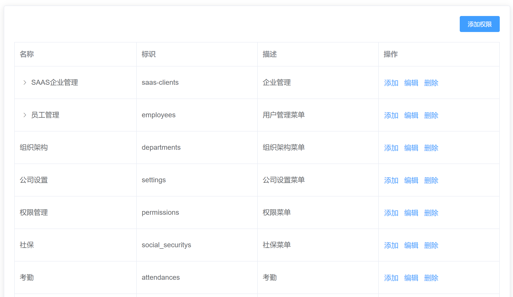
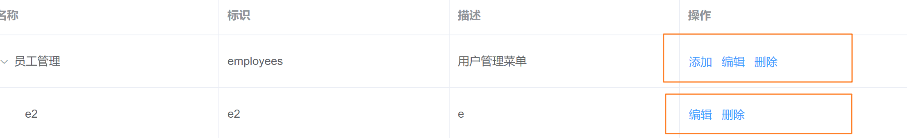
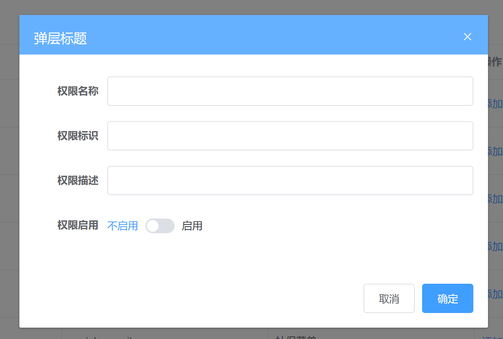

## 1. 静态结构搭建和接口封装




**`本节目标:`** 完成权限点列表布局和接口准备

**完成权限页面结构**

 **`src/views/permission/index.vue`**

```html
<template>
  <div class="permission-container">
    <div class="app-container">
      <!-- 表格 -->
      <el-card>
        <div style="text-align: right; margin-bottom: 20px">
          <el-button type="primary" size="small">添加权限</el-button>
        </div>
        <el-table border>
          <el-table-column label="名称" />
          <el-table-column label="标识" />
          <el-table-column label="描述" />
          <el-table-column label="操作">
            <template>
              <el-button type="text">添加</el-button>
              <el-button type="text">编辑</el-button>
              <el-button type="text">删除</el-button>
            </template>
          </el-table-column>
        </el-table>
      </el-card>
    </div>
  </div>
</template>
```

**封装权限管理的增删改查请求**

  **`src/api/permisson.js`**

```js
import request from '@/utils/request'

// 获取权限列表
export function getPermissionList(params) {
  return request({
    url: '/sys/permission',
    params
  })
}
// 新增权限
export function addPermission(data) {
  return request({
    url: '/sys/permission',
    method: 'post',
    data
  })
}

// 更新权限
export function updatePermission(data) {
  return request({
    url: `/sys/permission/${data.id}`,
    method: 'put',
    data
  })
}

// 删除权限
export function delPermission(id) {
  return request({
    url: `/sys/permission/${id}`,
    method: 'delete'
  })
}

// 获取权限详情
export function getPermissionDetail(id) {
  return request({
    url: `/sys/permission/${id}`
  })
}
```

## 2. 调用接口获取并展示数据

**`本节目标:`**   正确获取数据并完成视图渲染

```jsx
<template>
  <div class="permission-container">
    <div class="app-container">
      <!-- 表格 -->
      <el-card>
        <div style="text-align: right; margin-bottom: 20px">
          <el-button type="primary" size="small">添加权限</el-button>
        </div>
        <el-table border :data="list">
          <el-table-column label="名称" prop="name" />
          <el-table-column label="标识" prop="code" />
          <el-table-column label="描述" prop="description" />
          <el-table-column label="操作">
            <template>
              <el-button type="text">添加</el-button>
              <el-button type="text">编辑</el-button>
              <el-button type="text">删除</el-button>
            </template>
          </el-table-column>
        </el-table>
      </el-card>
    </div>
  </div>
</template>

<script>
import { getPermissionList } from '@/api/permission'

export default {
  name: 'Permission',
  data() {
    return {
      list: []
    }
  },
  mounted() {
    this.hGetPermissionList()
  },
  methods: {
    async hGetPermissionList() {
      const { data } = await getPermissionList()
      this.list = data
    }
  }
}
</script>
```

但是这里的数据拿到的是列表式的数据，但是希望渲染的是树形结构的，所以需要处理

## 3.  数据处理和table树形展示

**`本节目标:`**  把后端数据进行树形结构化处理并完成视图树形展示

1）使用现成的树形处理方法处理数据

```html
<script>
import { getPermissionList } from '@/api/permission'
import { transTree } from '@/utils/transTree'
export default {
  name: 'Permission',
  data() {
    return {
      list: []
    }
  },
  mounted() {
    this.hGetPermissionList()
  },
  methods: {
    async hGetPermissionList() {
      const res = await getPermissionList()
      this.list = transTree(res.data)
    }
  }
}
</script>
```

2）table组件树形展示

> 给 table 表格添加 row-key 属性即可，要求传递一个唯一的标识字段 id


```html
<el-table border :data="list" row-key="id">
  <el-table-column label="名称" prop="name" />
  <el-table-column label="标识" prop="code" />
  <el-table-column label="描述" prop="description" />
  <el-table-column label="操作">
    <template>
      <el-button type="text">添加</el-button>
      <el-button type="text">编辑</el-button>
      <el-button type="text">删除</el-button>
    </template>
  </el-table-column>
</el-table>

```


**注意：**当type为1时为路由页面访问权限，type为2时为按钮功能操作权限，添加按钮只有在type为1时才可以显示





```jsx
<template>
  <div class="permission-container">
    <div class="app-container">
      <!-- 表格 -->
      <el-card>
        <div style="text-align: right; margin-bottom: 20px">
          <el-button type="primary" size="small">添加权限</el-button>
        </div>
        <el-table border :data="list" row-key="id">
          <el-table-column label="名称" prop="name" />
          <el-table-column label="标识" prop="code" />
          <el-table-column label="描述" prop="description" />
          <el-table-column label="操作">
            <template #default="{ row }">
              <el-button v-if="row.type === 1" type="text">添加</el-button>
              <el-button type="text">编辑</el-button>
              <el-button type="text">删除</el-button>
            </template>
          </el-table-column>
        </el-table>
      </el-card>
    </div>
  </div>
</template>
```

## 4. 添加权限点

### 准备新增弹框



```HTML
<el-dialog :visible="showDialog" title="弹层标题" @close="showDialog = false">
  <el-form label-width="100px">
    <el-form-item label="权限名称">
      <el-input />
    </el-form-item>
    <el-form-item label="权限标识">
      <el-input />
    </el-form-item>
    <el-form-item label="权限描述">
      <el-input />
    </el-form-item>
    <el-form-item label="权限启用">
      <el-switch
        active-text="启用"
        active-value="1"
        inactive-text="不启用"
        inactive-value="0"
      />
    </el-form-item>
  </el-form>
  <template #footer>
    <div style="text-align: right;">
      <el-button @click="showDialog = false">取消</el-button>
      <el-button type="primary">确定</el-button>
    </div>
  </template>
</el-dialog>
```

### 表单绑定数据

```jsx
data() {
  return {
    list: [],
    showDialog: false,
    formData: {
      enVisible: '0', // 开启
      name: '', // 名称
      code: '', // 权限标识
      description: '', // 描述
      type: '', // 类型 
      pid: '' // 添加到哪个节点下
    }
  }
}

<el-dialog :visible="showDialog" title="弹层标题" @close="showDialog = false">
  <!-- 表单内容 -->
  <el-form label-width="100px">
    <el-form-item label="权限名称">
      <el-input v-model="formData.name" />
    </el-form-item>
    <el-form-item label="权限标识">
      <el-input v-model="formData.code" />
    </el-form-item>
    <el-form-item label="权限描述">
      <el-input v-model="formData.description" />
    </el-form-item>
    <el-form-item label="权限启用">
      <el-switch
        v-model="formData.enVisible"
        active-text="启用"
        active-value="1"
        inactive-text="不启用"
        inactive-value="0"
      />
    </el-form-item>
  </el-form>

  <template #footer>
    <div style="text-align: right;">
      <el-button @click="showDialog = false">取消</el-button>
      <el-button type="primary">确定</el-button>
    </div>
  </template>
</el-dialog>
```

### 新增业务实现

> 新增的权限点分为俩类： 
>
> 1. 点击上面的添加权限， 添加是一级路由的访问权限也就是菜单的权限 （type=1，pid=''）
>
> 2. 点击下面的添加权限点，添加的是路由对应组件里面按钮的操作权限 (type=2，pid为当前需要添加的项id)
>

```jsx
// 记录关键信息 type和pid
addPerssion(type, id) {
  this.showDialog = true
  // 记录当前添加的关键信息
  this.formData.type = type
  this.formData.pid = id
}

// 通过父传子传给子组件
<add-permision
  :type="type"
  :pid="pid"
/>

// 子组件新增按钮调用时使用
await addPermission({
  ...this.formData,
  type: this.type,
  pid: this.pid
})
```

## 5.  删除权限点

**`本节目标:`** 完成权限点删除业务逻辑

**1. 注册点击事件**

```jsx
<el-button size="small" type="text" @click="delPermission(row.id)">删除</el-button>
```

**2. 点击时发送删除请求**

```js
 delPermission(id) {
  this.$confirm('确定要删除该权限吗?', '温馨提示').then(async() => {
    await delPermission(id)
    // 更新列表
    this.fetchList()
  }).catch(() => {
    console.log('取消')
  })
}
```

## 6. 编辑权限点

**`本节目标:`** 完成权限点的编辑业务处理

**注册事件**

```html
<el-button type="text"@click="editPermission(row.id)">编辑</el-button>
```

**回显数据**

```js
// 父组件
editPermission(id) {
  this.visible = true
  // 调用子组件中的getDetail方法并且传入id
  this.$refs.addPermision.getDetail(id)
}

// 子组件
// 获取详情的方法
async getDetail(id) {
  const res = await getPermissionDetail(id)
  this.formData = res
}
```

**提交修改（根据id区分接口调用）**

```js
async confirmAdd() {
  // 做判断 看看当前是编辑还是新增
  if (this.formData.id) {
    // 更新接口(回显数据后 数据都是全的 所以直接使用formData就行)
    updatePermission(this.formData)
  } else {
    // 新增接口
    await addPermission({
      ...this.formData,
      type: this.type,
      pid: this.pid
    })
  }
  // 关闭弹框
  this.closeDialog()
  // 清空数据
  this.formData = {}
  // 更新列表
  this.$emit('update-list')
}
```
