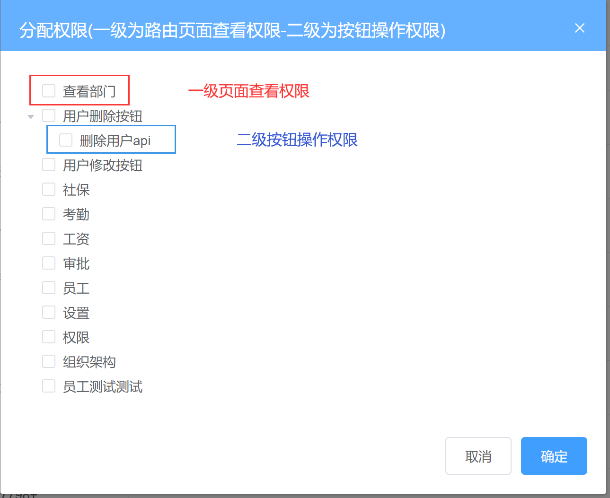

## 1. RBAC权限设计思想

> RBAC的权限模型，RBAC(Role-Based Access control) ，也就是基于角色的权限分配解决方案

### 权限流程图


三个关键点:  用户，角色， 权限点

1. 给用户分配角色
2. 给角色分配权限点

### 业务模块数据流转

实际业务里面：我们已经做完了和权限管理相关的三个模块，角色管理，员工管理和权限点管理，在接下来的时间里，我们会按照RBAC指导思想按照以下流程来实现我们的权限管理工作（为了清楚，一切我们都从零开始）

1. 建立一个角色 （比如前端讲师角色）
2. 给某个员工分配这个角色

3. 给这个角色分配权限点
4. 查看这个员工是否有了权限数据

## 2. 给员工分配角色

**`本节目标:`**在员工管理页面给员工分配各种角色

用户和角色是**`1对多`**的关系，即一个用户可以拥有多个角色，比如公司的董事长可以拥有总经理和系统管理员一样的角色，那董事长就拥有了总经理和系统管理员下的所有的权限点


### 新建角色弹框并控制显示

> 当当前组件体积已经偏大的时候，为了维护性考虑有必要把新功能抽离成一个新组件

1）准备静态模板

**`employees/components/assign-role.vue`** 	

```vue
<template>
  <el-dialog class="assign-role" title="分配角色" :visible="showRoleDialog">
    <!-- 这里准备复选框 -->
    <template #footer>
      <el-button type="primary" size="small">确定</el-button>
      <el-button size="small">取消</el-button>
    </template>
  </el-dialog>
</template>

<script>
export default {
  props: {
    showRoleDialog: {
      type: Boolean,
      default: false
    }
  }
}
</script>
```

2）注册组件

```jsx
import AssignRole from './components/assign-role'

components: {
  AddEmployee,
  AssignRole
},
  
<assign-role :show-role-dialog.sync="showRoleDialog"/>
```

3）点击角色按钮，记录id，显示弹层

```jsx
<el-button type="text" size="small" @click="editRole">分配角色</el-button>

editRole(id) {
  this.showRoleDialog = true
  this.curId = id
}
```

4）弹层的关闭

```html
<template>
  <el-dialog class="assign-role" title="分配角色" :visible="showRoleDialog" @close="closeDialog">
    <!-- el-checkbox-group选中的是 当前用户所拥有的角色  需要绑定 当前用户拥有的角色-->
    <el-checkbox-group>
      <!-- 选项 -->
    </el-checkbox-group>

    <template #footer>
      <div style="text-align: right">
        <el-button type="primary">确定</el-button>
        <el-button @click="closeDialog">取消</el-button>
      </div>
    </template>
  </el-dialog>
</template>

<script>
export default {
  props: {
    showRoleDialog: {
      type: Boolean,
      default: false
    }
  },
  methods: {
    closeDialog() {
      this.$emit('close-dialog')
    }
  }
}
</script>
```


### 获取角色列表

**准备多选框**

```jsx
<el-checkbox-group v-model="roleIds">
  <el-checkbox label="110">管理员</el-checkbox>
  <el-checkbox label="113">开发者</el-checkbox>
  <el-checkbox label="115">人事</el-checkbox>
</el-checkbox-group>
```

**发送请求获取角色列表**

> 注意：
>
> 1. 我们没有专门用来做当前功能的角色列表，我们可以暂时使用pageSize为100获取数据
> 2. 我们选择在弹框正式打开之后调用接口获取角色列表

```js
import { getRoleList } from '@/api/setting'
export default {
  props: {
    showRoleDialog: {
      type: Boolean,
      default: false
    },
    curId:{
        type:String,
        default:''
    }
  },
  data() {
    return {
      list: [], // 可选角色列表
      roleIds: [] // 已选角色列表
    }
  },
  methods: {
    closeDialog() {
      this.$emit('showRoleDialog', false)
    },
    async getRoleList() {
      const data = await reqGetRoles(1, 100)
      this.list = data.rows
    },
    openDialog(){
        this.getRoleList()
    } 
  }
}
```

渲染数据

```jsx
<el-checkbox-group v-model="roleIds">
  <!-- 注意：label决定当前选中的值 -->
  <el-checkbox v-for="item in list" :key="item.id" :label="item.id">
    {{ item.name }}
  </el-checkbox>
</el-checkbox-group>
```

微调样式

```jsx
<style lang="scss" scoped>
.assign-role {
  ::v-deep {
    .el-checkbox {
      font-size: 30px;
    }
  }
}
</style>
```


### 给员工分配角色

**分配角色接口**  **`api/employees.js`**

```js
/**
 * @description: 为用户分配角色
 * @param {*} data { id:当前用户id, roleIds:选中的角色id组成的数组 }
 * @return {*}
 */
export function assignRoles(data) {
  return request({
    url: '/sys/user/assignRoles',
    data,
    method: 'put'
  })
}
```

**确定保存**  **`assign-role`**

```html
<template>
  <el-button type="primary" size="small" @click="hAssignRoles">确定</el-button>
</template>
<script>
  export default {
     methods:{
         async clickSubmit() {
              await assignRoles({
                id: this.curId, 
                roleIds: this.roleIds
              })
              // 关闭弹框
              this.closeDialog()
         }
     }
  }
</script>
```

### 回显当前用户角色

> 如果当前用户已经配置过一些角色数据，应该先把已经配置过的角色数据回显回来才可以
>
> 1. 获取一下当前员工的详情数据  有我们刚才添加的角色数据 roleIds:['xxx']
> 2. 如果要回显  只需要把上一步保存好的roleIds交给双向绑定的 checkList

**获取用户的当前角色, 进行回显**  

```html
<script>
 import { getUserDetailById } from '@/api/user'
 export default {
    props: {
       // 用户的id 用来查询当前用户的角色信息
        curId: {
          type: String,
          default: ''
        }
    },
    openDialog(){
        // 获取当前用户数据 配合角色列表进行回显
        this.hGetUserDetailById()
    }
    methods:{
       async hGetUserDetailById() {
          const res = await getUserDetailById(this.userId)
          this.roleIds = res.roleIds
       }
    }
 }
</script>
```


## 3. 给角色分配权限点

**`本节目标:`** 完成给角色分配权限点的业务


### 新建分配权限弹出层

> 准备弹框 ->   注册事件 ->  提供数据方法

```jsx
<!-- 分配权限的弹层 -->
<el-dialog 
    title="分配权限(一级为路由页面查看权限-二级为按钮操作权限)" :visible="showAssignDialog">
  <!-- 权限点数据展示 -->
  <template #footer>
    <div style="text-align: right;">
      <el-button @click="closeAssignDialog">取消</el-button>
      <el-button type="primary">确定</el-button>
    </div>
  </template>
</el-dialog>
```


```jsx
<el-button size="small" type="success" @click="clickShowAssignDialog(row.id)">
    分配权限
</el-button>
```


```html
<script>
 export default {
    data(){
      return {
         showAssignDialog: false, // 控制弹层的显示隐藏
		 roleId: '' // 记录正在操作的角色id
      }
    },
    methods:{
      clickShowAssignDialog(id) {
         this.roleId = id
         this.showAssignDialog = true
      } 
    }
 }
</script>
```

### 获取权限点数据

> 引入获取权限点接口 ->  准备接收接口数据的响应式属性 ->  准备方法调用接口 ->  执行方法

```jsx
permissionData: [] // 存储权限数据
```

拿到数据处理成功树形结构并在弹框展示之后调用此方法

```jsx
async hGetPermissionList() {
  // 发送请求, 获取权限列表
  const res = await getPermissionList()
  this.permissionData = transTree(res.data)
}
```

### 使用树形控件展示权限点数据

> 基本展示三个基础属性配置：
>
> 1. show-checkbox 显示选择框
>
> 2. default-expand-all 默认展开
>
> 3. check-strictly  设置true，可以关闭父子关联

```jsx
<el-tree
  :data="permissionData"
  :props="{ label: 'name' }"
  :default-expand-all="true"
  :show-checkbox="true"
  :check-strictly="true"
/>
```




### 调用接口给角色分配权限点

**封装分配权限的api**  **`src/api/setting.js`**

```js
// 给角色分配权限 {id:角色id, permIds:[] 所有选中的节点的id组成的数组}
export function assignPerm(data) {
  return request({
    url: '/sys/role/assignPrem',
    method: 'put',
    data
  })
}
```

**分配权限**

```js
// 分配权限
async clickAssign() {
  await reqAssignPerm({
    id: this.roleId,
    permIds: this.$refs.tree.getCheckedKeys()
  })
  this.$message.success('分配成功')
  this.showAssignDialog = false
}
```

**弹框关闭清空数据**

```js
assignClose() {
  this.$refs.tree.setCheckedKeys([])
}
```

### 回显权限数据

> 当前的用户可能有一些默认的权限，需要我们回显出来
>
> 关键方法：`this.$refs.tree.setCheckedKeys([ ])`    =>   传入选中的node-key数组

```js
/**
 * @description: 获取角色详情
 * @param {*} data {id:当前角色id}
 * @return {*}
 */
export function getRoleDetailById(id) {
  return request({
    url: `/sys/role/${id}`,
    method: 'GET'
  })
}
```

```jsx
<el-tree
  ref="tree"
  :data="permissionData"
  :props="{ label: 'name' }"
  :default-expand-all="true"
  :show-checkbox="true"
  :check-strictly="true"
  node-key="id"
/>
```

发送请求获取已选中的权限 id 列表,进行回显

```jsx
async hGetPermissionList() {
  // 发送请求, 获取权限列表
  const data = await getPermissionList()
  this.permissionData = transToTreeData(data)
  // 发送请求, 获取当前默认权限id
  const roleDetail = await getRoleDetail(this.roleId)
  this.$refs.tree.setCheckedKeys(roleDetail.permIds)
}
```

## 4. 查看用户的权限数据

**`本节目标:`** 理解权限数据的生成逻辑并知道在哪里查看

> 到目前为止，我们实现了RBAC权限设计思想的各个环节，我们给员工分配了角色，给角色又分配了权限点，员工现在已经有了相对应的权限点，接下来我们就可以利用这些权限点做实际的权限控制，在人资项目里，权限的控制有俩个地方：
>
> 1. 左侧菜单权限控制 （一级）
> 2. 操作按钮权限控制 （一级菜单对应的组件 中 各个按钮的权限）

### 权限数据在哪里

在员工管理中新建一个全新的员工数据，然后使用全新的员工账号登录，查看个人信息接口返回数据，密码同为246810，下图看到的是没有配置任何权限的返回状态，可以看到，roles下的menus和points都为空，此时员工没有任何权限 


### 如何修改权限数据

使用管理员账号登录，然后给刚才创建的新员工分配俩个菜单权限和一个操作按钮权限，然后我们再次登录员工账号查看个人信息返回数据

操作步骤：

1. 权限点管理 >  给工资下增加`查看工资` 按钮操作权限点

2. 角色管理 >  新建前端讲师角色 >  给角色分配权限 （组织架构和工资）

3. 员工管理 > 给员工分配前端讲师角色

4. 重新登录新员工账号，再次查看权限数据

   


通过以上操作，相信大家已经知道何为权限数据，以及权限数据是怎么来的了~

## 5. 权限应用 - 控制动态路由（菜单）

### 整体控制思路


关键点：

1. 权限控制发生在pemission.js文件中
2. 拿到当前用户可访问的所有菜单标识
3. 拿到本地所有的动态路由列表
4. 俩份数据配合做过滤处理得到当前用户所有可以访问的动态路由表
5. 将路由表添加到路由系统中，让路由可被访问
6. 将路由表添加到菜单里显示到左侧

### 使用权限数据做过滤处理

> 上一步我们实现了把动态路由动态添加到了路由系统里和菜单数据中，但是我们没有和权限数据做搭配，接下来我们通过接口返回的权限数据对动态菜单做过滤处理，过滤使用`路由name`作为标识，对照下标检查路由name是否OK


**把菜单权限数据返回** `store/modules/user.js`

```js
async getUserInfo(ctx) {
  // 调用获取用户信息的接口
  const res = await getUserInfo()
  // 获取用户头像
  const info = await getUserDetailById(res.userId)
  ctx.commit('setUserInfo', { ...res, ...info })
  // 将个人权限数据返回
  return res.roles
}
```

**引入所有的动态路由表做过滤**

```js
import { asyncRoutes } from '@/router'

if (!store.getters.userId) {
    // 拿到菜单权限数据
    const roles = await store.dispatch('user/getUserInfo')
    // 做过滤处理
    // 如果路由的name属性能在menus权限数据中找到代表可以访问
    let filterRoutes = []
    filterRoutes = asyncRoutes.filter(route => {
      return roles.menus.includes(item.children[0].name)   
    })
    console.log('根据权限过滤后的路由表为:',filterRoutes)
}
```

### 使用addRoutes方法添加动态路由

> 上一步我们经过用户菜单权限数据和本地所有动态路由表的配合得到了`当前用户所有可访问的路由表`，然后我们需要做的就是把这个路由表动态的加入到路由系统中
>
> 核心方法：`addRoutes`  可以让我们在任何时间点把想要加入到路由系统中的路由表动态的加入到系统中而不依赖于routes配置项的初始化

```js
if (!store.getters.userId) {
    // 拿到菜单权限数据
    const roles = await store.dispatch('user/getUserInfo')
    // 这里做权限控制
    // 做过滤处理
    // 如果路由的name属性能在menus权限数据中找到代表可以访问
    let filterRoutes = []
    filterRoutes = asyncRoutes.filter(route => {
      return roles.menus.includes(item.children[0].name)   
    })
    // 把动态路由添加到应用的路由系统里
    router.addRoutes(filterRoutes)
}
```

手动在浏览器中输入某一个动态路由的地址，看看可不可以渲染出来对应的页面~

### 重写菜单的生成逻辑

> 当前的菜单渲染使用的数据：`this.$router.options.routes`
>
> 1. 这个数据是死的，并不会随着你调用addRoutes方法而变多
> 2. 这个数据并不是响应式的数据，即使里面有了数据也不会反应到视图中
>
> 也就是说，如果我们想在调用addRoutes方法之后，想要路由数据立刻反应到菜单中，我们需要像一个额外的方法，思考一下，vue开发中，哪个技术可以保证响应式特性还可以动态修改？ vuex管理

**1. 定义vuex管理菜单数据**

```js
// 导入静态路由
import { constantRoutes } from '@/router'
export default {
  namespaced: true,
  state: {
    // 先以静态路由表作为菜单数据的初始值
    menuList: [...constantRoutes]
  },
  mutations: {
    setMenuList(state, asyncRoutes) {
      // 将动态路由和静态路由组合起来
      state.menuList = [...constantRoutes, ...asyncRoutes]
    }
  }
}
```

**2. 提交setMenuList生成完整的菜单数据**

```js
if (!store.getters.userId) {
    await store.dispatch('user/getUserInfo')
    // 把动态路由添加到应用的路由系统里
    router.addRoutes(asyncRoutes)
    // 把动态路由数据交给菜单
    store.commit('routeMenu/setMenuList', asyncRoutes)
}
```

**3. 菜单生成部分改写使用vuex中的数据**

```js
routes() {
  // 拿到的是一个完整的包含了静态路由和动态路由的数据结构
  // return this.$router.options.routes
  return this.$store.state.routeMenu.menuList
}
```

### 404Bug处理


### 退出登录时重置路由

**现存问题**

> 假如A用户先进行的登录 它的菜单权限是 ['工资'，'社保']，退出登录之后使用B用户登录，此时B用户的菜单权限为['工资']，但是因为上一个路由记录还在，所以B用户同样可以访问到`社保` 模块，这显然是不对的，所以要求我们在退出登录的时候先清除一下先前的路由记录

**解决方案**

> vue-router 提供了addRoute来进行添加路由，但是却没有移除路由的相关选项，当切换用户的时候，想要移除路由再添加怎么办呢？可以另外建一个router实例来替换之前的实例。
>
> [vuejs/vue-router#1234](https://github.com/vuejs/vue-router/issues/1234)

我们的**`router/index.js`**文件，发现一个重置路由方法

```js
// 重置路由
export function resetRouter() {
  const newRouter = createRouter()
  router.matcher = newRouter.matcher // 重新设置路由的可匹配路径
}
```

这个方法就是将路由重新实例化，相当于换了一个新的路由，之前**`加的路由`**就不存在了，需要在登出的时候， 调用一下即可

`store/modules/user.js`

```js
import { resetRouter } from '@/router'
// 退出的action操作
logout(context) {
  // 1. 移除vuex个人信息
  context.commit('removeUserInfo')
  // 2. 移除token信息
  context.commit('removeToken')
  // 3. 重置路由系统
  resetRouter()
}
```

## 6. 权限应用 - 控制操作按钮


1）定义全局指令

```js
import Vue from 'vue'
import store from '@/store'

Vue.directive('checkBtn', {
  inserted(el, binding) {
    const { value } = binding
    const hasPermission = store.state.user.userInfo.roles.points.includes(value)
    if (!hasPermission) {
      el.parentNode.removeChild(el)
      // el.remove()
    }
  }
})
```

2）使用全局指令

```html
<!-- CKGZ -->
<el-button v-checkBtn="'CKGZ'">查看工资</el-button>
<!-- XGGZ -->
<el-button v-checkBtn="'XGGZ'">修改工资</el-button>
```

