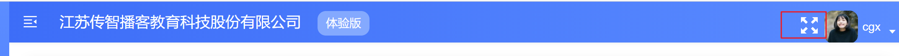
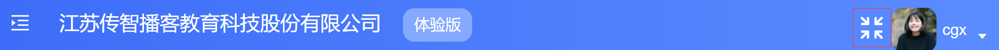
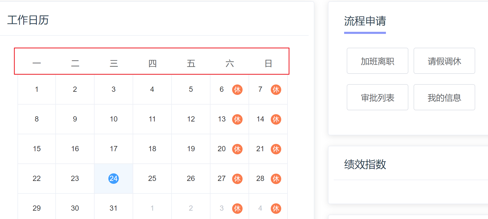
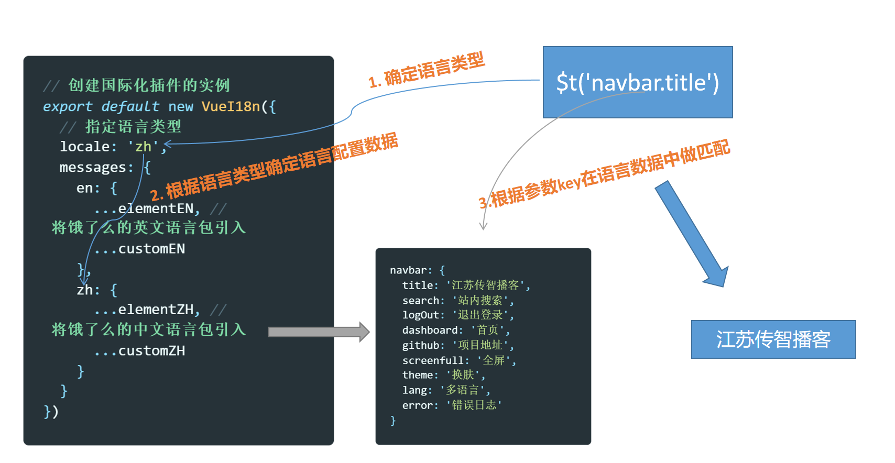
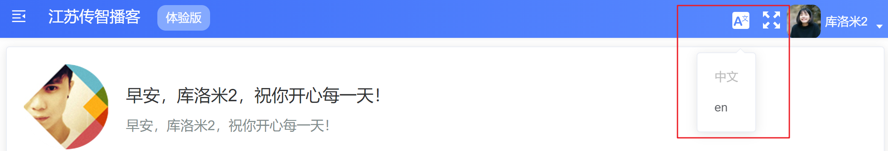

## 1. 全屏功能实现

**`本节目标:`**  实现全屏切换功能

### 需求理解





### 实现全屏逻辑

> 核心技术：
>
> 浏览器底层给我们提供了开启全屏和关闭全屏的API，因为有兼容性问题，所以我们借助社区成熟的全屏插件来实现功能
>
> 1 开启全屏: document.documentElement.requestFullscreen()
>
> 2 关闭全屏: document.exitFullscreen()

核心思路（取反操作）

1. 如果当前是全屏状态就关闭全屏
2. 如果当前是非全屏状态就开启全屏
3. 调用API之后把当前是否为全屏的状态切换一下

代码实现：

```html
<svg-icon icon-class="fullscreen" class="fullscreen" @click="toggleScreen" />

<script>
export default {
  name: 'ScreenFull',
  data() {
    return {
      isScreenFull: false
    }
  },
  methods: {
    toggleScreen() {
      // 如果未开启就开启 如果已开启就关闭
      if (this.isScreenFull) {
        document.exitFullscreen()
      } else {
        document.documentElement.requestFullscreen()
      }
      this.isScreenFull = !this.isScreenFull
    }
  }
}
</script>
```

### 实现全屏icon切换

```html
<svg-icon
  :icon-class="isScreenFull? 'exit-fullscreen': 'fullscreen'"
  class="fullscreen"
  @click="toggleScreen"
/>
```

### 监听ESC退出

现存问题：当我们点击浏览器叉号或者ESC键退出全屏的时候，发现我们的icon图标并没有修改，这是因为浏览器退出之后并不会自动同步到`isScreenFull`，需要我们手动将当前的全屏状态同步给 `isScreenFull`

如何解决：监听浏览器退出全屏的时候，把本地状态改为false

```js
mounted() {
    document.addEventListener('fullscreenchange', e => {
      // 监听到屏幕变化，在回调中判断是否已退出全屏 如果已退出全屏 把本地状态修改为false
      let isFull = document.fullscreenElement
      if (!isFull) {
        this.isScreenFull = false
      }
    })
}
```

### 聊聊兼容问题

全屏插件：https://github.com/sindresorhus/screenfull.js#readme

检测api兼容情况：https://www.caniuse.com/

## 2. 多语言支持

**`本节目标:`**  实现中英文切换功能 （特别注意：vue-i18n版本需要控制在8）

### 应用接入多语言支持

> 多语言功能的实现写法是死的，难在步骤繁多，需要细心

**第一步，我们需要首先国际化的包**

```bash
npm install vue-i18n@8.0.0  --save
```

**第二步，需要单独一个多语言的实例化文件 `src/lang/index.js`**

```js
import Vue from 'vue' // 引入Vue
import VueI18n from 'vue-i18n' // 引入国际化的插件包
Vue.use(VueI18n) // 全局注册国际化包

// 创建国际化插件的实例
export default new VueI18n({
  // 指定语言类型 zh表示中文  en表示英文
  locale: 'zh'
})
```

**第三步，在main.js中挂载 i18n的插件**

```js
import i18n from '@/lang'
// 加入到根实例配置项中
new Vue({
  el: '#app',
  router,
  store,
  i18n,
  render: h => h(App)
})
```

### ElementUI多语言配置

**引入element语言包文件`src/lang/index.js`**

```js
// 进行多语言支持配置
import Vue from 'vue' // 引入Vue
import VueI18n from 'vue-i18n' // 引入国际化的插件包
import locale from 'element-ui/lib/locale'
import elementEN from 'element-ui/lib/locale/lang/en' // 引入饿了么的英文包
import elementZH from 'element-ui/lib/locale/lang/zh-CN' // 引入饿了么的中文包
Vue.use(VueI18n) // 全局注册国际化包

// 创建国际化插件的实例
const i18n = new VueI18n({
  // 指定语言类型 zh表示中文  en表示英文
  // 初始化时先从本地cookie取一步,如果取到就以取到的为主
  locale: 'zh',
  // 将elementUI语言包加入到插件语言数据里
  messages: {
    // 英文环境下的语言数据
    en: {
      ...elementEN
    },
    // 中文环境下的语言数据
    zh: {
      ...elementZH
    }
  }
})
// 配置elementUI 语言转换关系
locale.i18n((key, value) => i18n.t(key, value))

export default i18n
```


手动修改locale属性，改成`zh` 或者 `en`   查看日历组件的星期显示



### 自定义内容多语言配置

> 上一小结，我们通过配置让ElementUI组件库内部支持了多语言配置，那我们自定义的内容部分也就是没有使用elementUI的部分该如何实现多语言呢？

#### 1. 引入自定义中英文配置

注：自定义语言配置文件在`项目资源/语言包`里面

```js
import Vue from 'vue'
import VueI18n from 'vue-i18n'
import elementEN from 'element-ui/lib/locale/lang/en'
import elementZH from 'element-ui/lib/locale/lang/zh-CN'
// 引入自定义中文包
import customZH from './zh' 
// 引入自定义英文包
import customEN from './en' 

Vue.use(VueI18n)

// 创建国际化插件的实例
export default new VueI18n({
  // 指定语言类型
  locale: 'zh',
  messages: {
    en: {
      ...elementEN, // 将饿了么的英文语言包引入
      ...customEN // 将自定义英文包加入
    },
    zh: {
      ...elementZH, // 将饿了么的中文语言包引入
      ...customZH // 将自定义中文包加入
    }
  }
})
```

#### 2. 理解中英文切换原理

当我们引入`VueI18n`语言插件之后，每个组件实例都拥有了一个`$t`方法，这个方法可以帮助我们进行语言转换，可以根据当前的语言类型，使用传入的key去寻找当前key对应的文本，基础原理如下图：



#### 3. 实现title中英文切换

**添加语言配置**

`zh.js`

```js
export default {
  navbar: {
    title: '江苏传智播客', // 添加中文环境下title配置
    search: '站内搜索',
    logOut: '退出登录',
    dashboard: '首页',
    github: '项目地址',
    screenfull: '全屏',
    theme: '换肤',
    lang: '多语言',
    error: '错误日志'
  }
}
```

`en.js`

```js
export default {
  navbar: {
    title: 'Jiangsu value-added Podcast', // 添加英文环境下title配置
    search: 'search',
    logOut: 'Log Out',
    dashboard: 'Dashboard',
    github: 'Github',
    screenfull: 'screenfull',
    theme: 'theme',
    lang: 'i18n',
    error: 'error log'
  }
}
```

**修改头部模板渲染**

```html
<div class="app-breadcrumb">
  {{ $t('navbar.title') }}
  <span class="breadBtn">体验版</span>
</div>
```

**手动将locale进行en和zh切换查看效果**

`src/lang/index.js`

```js
export default new VueI18n({
  // 切换这里试试
  locale: 'zh'
  ...
})
```

### 实现动态切换中英文

> 现在我们虽然已经实现了中英文切换的核心逻辑，但是是死的，不能动态切换，我们想要实现以下的效果，点击中英文按钮，弹出下拉框，当我们点击中文和en的时候可以实现动态的切换当前的语言



核心思路：点击下拉框时把当前选择的语言赋值给`this.$i18n.locale`属性即可

**封装多语言组件** 

 **`src/components/Lang/index.vue`**

```vue
<template>
  <el-dropdown trigger="click" @command="changeLanguage">
    <div>
      <svg-icon style="color:#fff;font-size:20px" icon-class="language" />
    </div>
    <el-dropdown-menu slot="dropdown">
      <el-dropdown-item command="zh" :disabled="'zh'=== $i18n.locale ">中文</el-dropdown-item>
      <el-dropdown-item command="en" :disabled="'en'=== $i18n.locale ">en</el-dropdown-item>
    </el-dropdown-menu>
  </el-dropdown>
</template>

<script>
export default {
  methods: {
    changeLanguage(lang) {
      this.$i18n.locale = lang // 设置给本地的i18n插件
      this.$message.success('切换多语言成功')
    }
  }
}
</script>
```

`component/index.js`全局注册

```jsx
import Lang from './Lang'
export default {
  // 插件的初始化, 插件给你提供的全局的功能, 都可以在这里配置
  install(Vue) {
    // 进行组件的全局注册
    Vue.component('Lang', Lang)
  }
}
```

**在Navbar组件中引入**

```vue
<!-- 语言包 -->
<lang class="right-menu-item" />
<!-- 全屏组件 -->
<screen-full class="right-menu-item" />
```

### 多语言支持业务总结

1. 多语言支持需要翻译人员给到我们完整的各种语言对应关系
2. 哪块视图需要支持多语言，就去哪块视图替换（繁琐的体力活）
3. vue项目中的多语言支持使用的是`vue-i18n`  https://kazupon.github.io/vue-i18n/zh/started.html

