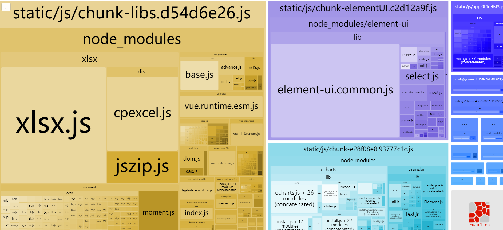

## 1. 包大小分析和CDN的应用

### 环境变量和publicPath配置

`.env.production`

```
VUE_APP_BASE_URL= 'http://ihrm-java.itheima.net/api'
```

`vue.config.js`

```js
module.exports = {
    publicPath:'./'  // 为了浏览起来获取静态资源方便
}
```

### 包大小分析

**`本节目标:`**  对开发的应用进行包大小分析

> 我们集成了功能，写了很多组件，最终都会打包成一堆文件，每个包大小如何呢？

我们可以使用vue-cli本身提供的性能分析工具，对我们开发的所有功能进行打包分析，它的应用非常简单，我们单独在`package.json`文件的scripts命令行配置中添加一个打包生成报告的命令

```bash
"scripts": {
    "report":"vue-cli-service build --report"
}
```

这个命令会从我们的**`入口main.js`**进行依赖分析，分析出最大的包，方便我们进行观察和优化

执行完这个命令，我们会看到如下的页面



如图所以，方块越大，说明该文件占用的文件越大，文件越大，对于网络带宽和访问速度的要求就越高，这也就是我们优化的方向，比如Xlsx文件就很大，而且这类插件长期不需要我们进行更新

### webpack配置排除打包

**`本节目标:`** 通过配置vue-cli把不需要打包进入bundle中的文件排除

> 那些体积太大而且长期不会发生变化的包，我们可以通过webpack的配置进行排除，不打入最终的包里，以减小生产包的最终大小
>
> 核心手段：把三个体积较大的变动不大的文件 通过CDN的方式引入  不打包到最终的bundle文件中去

**使用方式**

先找到 `vue.config.js`， 添加 `externals` 让 `webpack` 不打包 `vue` `xlsx` 和 `element`   

**`vue.config.js`**

```js
configureWebpack: {
  // 配置单页应用程序的页面的标题
  name: name,
  externals: {
     /**
      * externals 对象属性解析：
      * '包名' : '在项目中引入的名字
    */
    'vue': 'Vue',
    'element-ui': 'ELEMENT',
    'xlsx': 'XLSX'
  },
  resolve: {
    alias: {
      '@': resolve('src')
    }
  }
}
```

再次运行，我们会发现包的大小已经大幅减小，但是这些被我们排除在外的包应用还需要用到，怎么办呢，我们需要**采用CDN配置链接的方式链接到我们的应用里**

### 生产环境下的CDN文件配置

**`本节目标:`**  在生产环境下把排除在外的包通过三方CDN的方式引入到应用里

1 )  CDN的主要好处

- 加快静态资源的访问 (就近原则)
- 利用浏览器缓存，不会变动的文件长期缓存 (http://itcast.com/static/js/app.js)

2）vue-cli的cdn配置

**`vue.config.js`**

```js
let cdn = {
    css: [
      'https://unpkg.com/element-ui/lib/theme-chalk/index.css' // element-ui css 样式表
    ],
    js: [
      // vue must at first!
      'https://unpkg.com/vue@2.6.12/dist/vue.js', // vuejs
      'https://unpkg.com/element-ui/lib/index.js', // element-ui js
      'https://cdn.jsdelivr.net/npm/xlsx@0.16.6/dist/xlsx.full.min.js'
    ]
}
```

> 但是请注意，这时的配置实际上是对开发环境和生产环境都生效的，在开发环境时，没有必要使用CDN，此时我们可以使用环境变量来进行区分
>

```js
let externals = {}
let cdn = { css: [], js: [] }
const isProduction = process.env.NODE_ENV === 'production' // 判断是否是生产环境
if (isProduction) {
  externals = {
    'vue': 'Vue',
    'element-ui': 'ELEMENT', // 必须是ELEMENT
    'xlsx': 'XLSX'
  }
  cdn = {
    css: [
      'https://unpkg.com/element-ui/lib/theme-chalk/index.css' // element-ui css 样式表
    ],
    js: [
    // vue must at first!
      'https://unpkg.com/vue@2.6.12/dist/vue.js', // vuejs
      'https://unpkg.com/element-ui@2.15.3/lib/index.js', // element-ui js 变化
      'https://cdn.jsdelivr.net/npm/xlsx@0.16.6/dist/xlsx.full.min.js'
    ]
  }
}
```

webpack配置externals配置项

```jsx
configureWebpack: {
  // 配置单页应用程序的页面的标题
  name: name,
  externals: externals,
  resolve: {
    alias: {
      '@': resolve('src')
    }
  }
}
```

3） 注入CDN文件到模板

之后通过 `html-webpack-plugin`注入到 `index.html`之中:

```js
chainWebpack(config) {
  config.plugin('preload').tap(() => [
    {
      rel: 'preload',
      fileBlacklist: [/\.map$/, /hot-update\.js$/, /runtime\..*\.js$/],
      include: 'initial'
    }
  ])
  // 注入cdn变量 (打包时会执行)
  config.plugin('html').tap(args => {
    args[0].cdn = cdn // 配置cdn给插件
    return args
  })
  ...
}
```

找到 `public/index.html`   通过你配置的`CDN Config` 依次注入 css 和 js

```vue
<head>
  <!-- 引入样式 -->
  <% for(var css of htmlWebpackPlugin.options.cdn.css) { %>
    <link rel="stylesheet" href="<%=css%>">
  <% } %>
</head>

<!-- 引入JS -->
<% for(var js of htmlWebpackPlugin.options.cdn.js) { %>
  <script src="<%=js%>"></script>
<% } %>
```

最后，进行打包 

```bash
npm run build:prod
```

## 2. 认识history路由模式

**`本节目标:`** 了解俩种单页应用的路由模式，清楚它们的区别

1）路由对比

| 路由模式 | URL对比                      | 刷新是否会有问题                    |
| -------- | ---------------------------- | ----------------------------------- |
| hash     | http://localhost:8080/#/home | 无                                  |
| history  | http://localhost:8080/home   | 有，需要后端做地址映射处理否则会404 |

2）应用路由配置

> 开发到现在，我们一直都在用hash模式，打包我们尝试用history模式

改成history模式非常简单，只需要将路由的mode类型改成history即可

```js
// 创建路由实例
const createRouter = () => new Router({
  mode: 'history', // require service support
  scrollBehavior: () => ({ y: 0 }),
  // 指定路由规则
  routes: [
    ...constantRoutes // 静态路由, 首页
  ]
})
```

配置好之后，我们访问路径不再需要加#号同样运行正常，这是因为 webpack 默认配好了对于 history 模式的处理，实际上线其实是有问题的，需要我们增加额外的配置

> 到现在为止，我们已经完成了一个前端工程师的开发流程，按照常规的做法，此时，运维会将我们的代码部署到ngix服务上，原则上我们已经不需要做任何工作了，为了拓展一下眼界，我们接下来做一些他们的工作

## 3. 补充-node模拟项目部署

### 使用 koa 框架创建静态服务器


1. 建立web服务文件夹  **`hrServer`**

2. 在该文件夹下，初始化npm

   ```bash
   npm init -y
   ```

3. 安装服务端框架koa(也可以采用express或者egg)

   ```bash
   npm install koa koa-static
   ```

4. hrServer中新建public目录，并拷贝上小节打包的dist目录内容，到**`hrServer/public`**下

5. 在根目录下创建app.js，代码如下

   ```js
   const Koa  = require('koa')
   const serve = require('koa-static');
   
   const app = new Koa();
   app.use(serve(__dirname + "/public")); //将public下的代码静态化
   app.listen(3333, () => {
     console.log('人资项目启动: 3333端口')
   })
   ```

6. 把前端项目打包之后的代码赋值到public文件夹中

7. 访问`localhost:3003`

### 解决history页面访问问题

> 问题：基于history模式下，浏览器一刷新就会出现页面丢失的问题

1）安装 koa中间件 

```bash 
npm install koa2-connect-history-api-fallback #专门处理history模式的中间件
```

2）使用中间件

```js
const Koa  = require('koa')
const serve = require('koa-static');
const { historyApiFallback } = require('koa2-connect-history-api-fallback');
const app = new Koa();
// 这句话 的意思是除接口之外所有的请求都发送给了 index.html
app.use(historyApiFallback({ 
  whiteList: ['/api']
}));  

// 这里的whiteList是 白名单的意思
app.use(serve(__dirname + "/public")); //将public下的代码静态化

app.listen(3333, () => {
  console.log('人资项目启动')
})
```

此时解决了刷新 404 的问题  (注意: 如果点了登录, 记得清除cookies 再测试)

### 解决生产环境跨域问题

> 问题：此时我们除了登录接口之外其他接口是不通的，我们需要在生产环境配置一下跨域，原理和我们之前用vue-cli配置的原理是一致的，都是通过中间的服务器经过转发去代理真实的接口

1）安装跨域代理中间件

```bash
npm install koa2-proxy-middleware
```

2）配置跨越代理

```js
const Koa  = require('koa')
const serve = require('koa-static');
const { historyApiFallback } = require('koa2-connect-history-api-fallback');
const proxy = require('koa2-proxy-middleware')
const app = new Koa();

app.use(proxy({
  targets: {
    '/api/(.*)': {
        target: 'http://ihrm-java.itheima.net', //后端服务器地址
        changeOrigin: true
    }
  }
}))

// 这句话 的意思是除接口之外所有的请求都发送给了 index.html
app.use(historyApiFallback({ 
  whiteList: ['/api']
}));  // 这里的whiteList是 白名单的意思

app.use(serve(__dirname + "/public")); //将public下的代码静态化

app.listen(3333, () => {
  console.log('人资项目启动')
})
```

### 前端修改生产环境下的baseUrl

前端修改生产环境的 baseUrl

`.env.production`

```jsx
VUE_APP_BASE_API = '/api'
```

重新打包，将目录重新给到node public 目录，重新运行

```jsx
npm run build
```

重新运行

```jsx
node app.js
```

此时，我们的项目就可以跨域访问了！

到现在为止，我们在十几天的时间里，完成了一个较为复杂的中台项目的解剖和开发，

任何一个复杂的项目都是各种各样的功能通过合理的设计和布局组装而成的，

所以未来我们不论项目的难度和复杂度，都要学会技术的解耦和设计，这样开发能力就会变得越来越强


